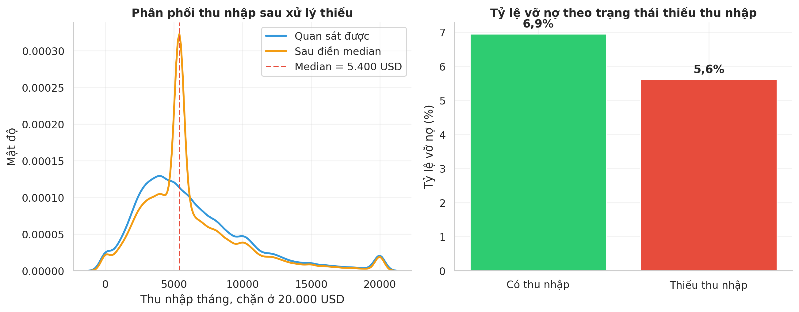
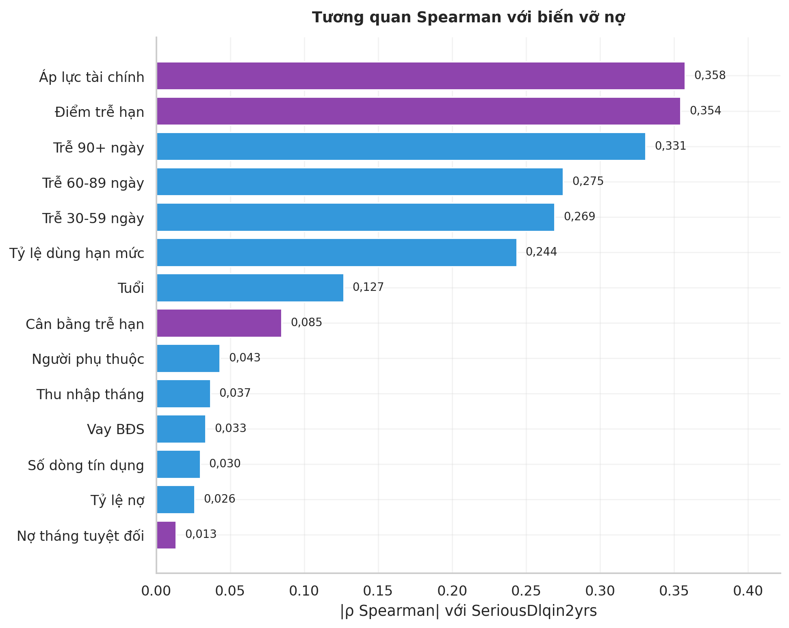
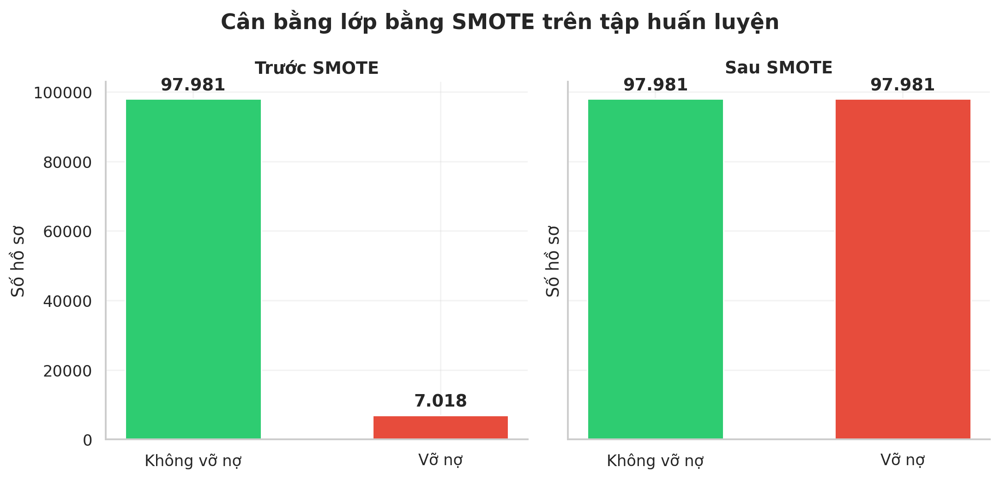
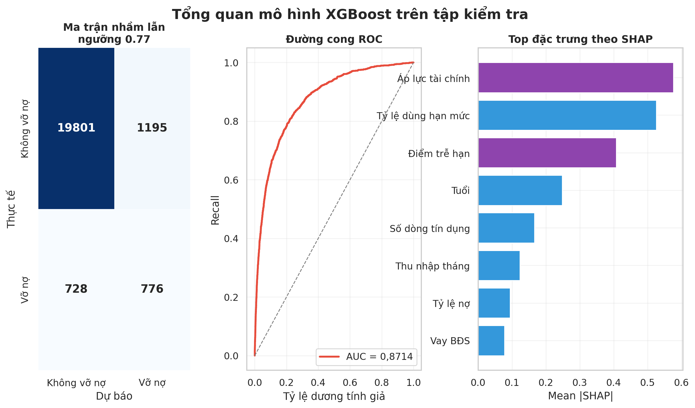
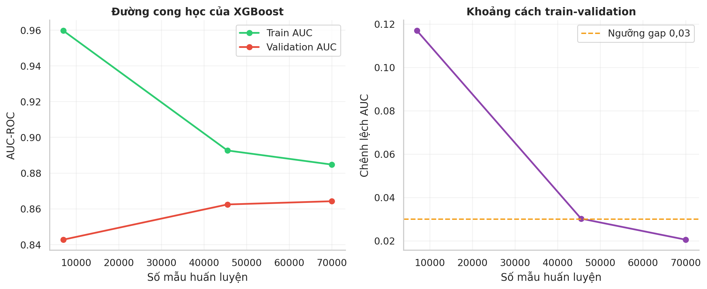
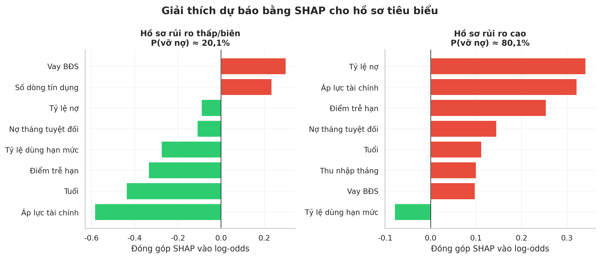

# DỰ BÁO RỦI RO VỠ NỢ TÍN DỤNG BẰNG MACHINE LEARNING
**Sinh viên thực hiện:** Đoàn Danh Long  
**Mã số sinh viên:** 20237354  
**Giảng viên hướng dẫn:** Nguyễn Cảnh Nam  
**Học kỳ:** 2025.2 - Năm học 2025–2026  

---

## LỜI CẢM ƠN

Em xin gửi lời cảm ơn chân thành đến Giảng viên hướng dẫn - Thầy Nguyễn Cảnh Nam, Khoa Toán–Tin, Trường Đại học Bách Khoa Hà Nội - đã tận tình hướng dẫn, góp ý và định hướng trong suốt quá trình thực hiện đồ án.

Em cũng xin cảm ơn gia đình và bạn bè đã luôn động viên, tạo điều kiện thuận lợi để em có thể hoàn thành đồ án đúng tiến độ.

Dù đã cố gắng hết sức, báo cáo chắc chắn còn nhiều thiếu sót. Em rất mong nhận được nhận xét và góp ý từ Thầy để tiếp tục cải thiện trong những nghiên cứu tiếp theo.

*Hà Nội, tháng 4 năm 2026 — Đoàn Danh Long*

---

## TÓM TẮT

Báo cáo trình bày nghiên cứu ứng dụng Machine Learning vào bài toán dự báo rủi ro vỡ nợ tín dụng, sử dụng bộ dữ liệu *Give Me Some Credit* (Kaggle, 149.999 hồ sơ vay sau khi loại 1 dòng tuổi = 0 từ tập gốc 150.000). Kết quả chính không chỉ là một mô hình có AUC cao hơn, mà là một quy trình chấm điểm rủi ro có thể giải thích, có ngưỡng vận hành và có demo đánh giá danh mục.

**Các kết quả nổi bật của đồ án:**

1. **Mô hình tốt nhất đạt AUC-ROC = 0,8714.** XGBoost vượt mục tiêu AUC > 0,87 và nhỉnh hơn Random Forest (0,8703), trong khi nhỏ hơn nhiều về kích thước model và nhanh hơn khi suy luận.
2. **Feature engineering tạo ra tín hiệu thật.** Hai đặc trưng tự thiết kế (`FinancialStressIndex`, `TotalDelinquencyScore`) nằm trong top-3 SHAP, cho thấy kiến thức nghiệp vụ về hạn mức tín dụng và lịch sử trễ hạn cải thiện khả năng phân biệt rủi ro.
3. **Ngưỡng mặc định không phù hợp với tín dụng.** Ở ngưỡng F1-optimal t=0,77, mô hình bỏ sót 48,4% người vỡ nợ. Chọn ngưỡng F2-optimal t=0,625 giúp Recall tăng từ 51,6% lên 66,9%, tương ứng giảm ước tính khoảng 2,01 triệu USD chi phí so với ngưỡng F1-optimal trên tập kiểm tra 22.500 hồ sơ.
4. **Sai số còn lại có nguyên nhân rõ ràng.** Nhóm False Negative thường không có lịch sử trễ hạn (`TotalDelinquencyScore = 0`, `FinancialStressIndex = 0`), nghĩa là họ “trông sạch” trong dữ liệu lịch sử. Đây là giới hạn của bộ đặc trưng hiện tại, không đơn thuần là lỗi thuật toán.
5. **Xác suất chưa được hiệu chỉnh tốt.** Brier Skill Score âm ở cả 4 mô hình cho thấy output phù hợp để xếp hạng rủi ro hơn là diễn giải như xác suất tuyệt đối. Nếu triển khai thật cần Platt Scaling hoặc Isotonic Regression.

Sản phẩm cuối là Streamlit dashboard cho phép dự báo từng khách hàng, giải thích bằng SHAP và đánh giá theo lô CSV/XLSX để xem chất lượng danh mục khách hàng.

**Từ khóa:** dự báo vỡ nợ, chấm điểm tín dụng, XGBoost, SHAP, tối ưu F-beta, mất cân bằng dữ liệu.

---

## BẢNG THUẬT NGỮ VIẾT TẮT

Báo cáo giữ một số thuật ngữ tiếng Anh đã trở thành chuẩn quốc tế để tránh dịch sai nghĩa kỹ thuật. Bảng dưới đây giải thích các thuật ngữ xuất hiện thường xuyên:

| Thuật ngữ | Giải nghĩa tiếng Việt |
|---|---|
| **AUC-ROC** (Area Under ROC Curve) | Diện tích dưới đường cong ROC — đo khả năng xếp hạng đúng giữa 2 hồ sơ ngẫu nhiên (thuộc 2 lớp khác nhau). 0,5 = ngẫu nhiên, 1 = hoàn hảo. |
| **TPR / FPR** (True/False Positive Rate) | Tỷ lệ dương tính thật / dương tính giả. TPR = Recall. |
| **TP / FP / TN / FN** | Dương tính thật / Dương tính giả / Âm tính thật / **Âm tính giả** (bỏ sót người vỡ nợ — đắt nhất trong tín dụng). |
| **Precision / Recall** | Độ chính xác / Độ phát hiện. Precision = TP/(TP+FP), Recall = TP/(TP+FN). |
| **F1 / F2 / F-beta** | Trung bình điều hòa Precision-Recall; F2 ưu tiên Recall gấp đôi Precision. |
| **SHAP** (SHapley Additive exPlanations) | Giá trị Shapley từ lý thuyết trò chơi hợp tác — phân tách dự báo thành đóng góp của từng đặc trưng. |
| **TreeExplainer** | Thuật toán chuyên biệt tính SHAP cho mô hình tree-based, độ phức tạp đa thức (thay vì $2^p$ tổ hợp). |
| **Bagging / Boosting** | Hai chiến lược ensemble: Bagging huấn luyện cây độc lập và lấy trung bình (giảm phương sai); Boosting huấn luyện cây tuần tự, mỗi cây sửa lỗi cây trước (giảm độ chệch). |
| **Bias / Variance** | Độ chệch / Phương sai — phân rã sai số mô hình theo lý thuyết học thống kê. |
| **Stratified K-Fold** | Chia tập huấn luyện thành K phần giữ nguyên tỷ lệ lớp dương — kiểm định chéo cho dữ liệu mất cân bằng. |
| **Class Imbalance** | Mất cân bằng lớp — lớp thiểu số (vỡ nợ) chỉ chiếm 6,68%, gây thiên lệch dự báo. |
| **scale_pos_weight** | Trọng số XGBoost nâng tầm quan trọng lớp thiểu số trong gradient cập nhật, giá trị = $n_{neg}/n_{pos}$. |
| **class_weight='balanced'** | Tham số scikit-learn nhân loss function của lớp thiểu số với hệ số $n/(2 \cdot n_c)$. |
| **VIF** (Variance Inflation Factor) | Hệ số phồng phương sai — đo mức đa cộng tuyến giữa các đặc trưng. |
| **MAR / MCAR / MNAR** | Cơ chế dữ liệu thiếu: Missing At Random / Completely At Random / Not At Random — quyết định phương pháp imputation hợp lệ. |
| **MICE / KNN Imputer** | Thuật toán điền giá trị thiếu: MICE chuỗi hồi quy, KNN dùng trung bình K láng giềng gần nhất. |
| **Gradient / Hessian** | Đạo hàm cấp 1 và 2 của hàm mất mát — XGBoost dùng cả 2 (Taylor expansion bậc 2). |
| **L1 / L2 Regularization** | Phạt $\|w\|_1$ (Lasso, sinh hệ số 0) / $\|w\|_2^2$ (Ridge, co hệ số) — chống overfit. |
| **Brier Score / ECE** | Chỉ số đánh giá chất lượng hiệu chỉnh xác suất (calibration); BS thấp = xác suất gần thực tế hơn, ECE = sai số hiệu chỉnh kỳ vọng. |
| **DeLong Test** | Kiểm định thống kê so sánh AUC của 2 mô hình trên cùng tập dữ liệu (xét tương quan giữa các điểm số). |
| **Platt Scaling** | Hiệu chỉnh xác suất bằng cách fit logistic regression trên đầu ra mô hình → chuyển score thô về xác suất hợp lý. |
| **Hyperparameter** | Siêu tham số — tham số chọn trước khi huấn luyện (max_depth, learning_rate, ...). |
| **RandomizedSearchCV / GridSearchCV** | Thuật toán tìm siêu tham số: ngẫu nhiên (n_iter mẫu) / vét cạn lưới. |
| **Threshold (ngưỡng phân loại)** | Giá trị $t$ để chuyển xác suất thành nhãn: $\hat{y} = \mathbb{1}[P(y=1\|x) \geq t]$. |
| **Baseline / Prevalence** | Tham chiếu / Tỷ lệ lớp dương trong dữ liệu (6,68% trong nghiên cứu này). |
| **Basel III** | Bộ chuẩn quốc tế về quản trị rủi ro ngân hàng (Ủy ban Basel, BIS) — Pillar 3 yêu cầu công bố thông tin rủi ro tín dụng. |
| **GDPR Article 22** | Điều 22 Quy định bảo vệ dữ liệu chung EU — quyền không bị quyết định tự động bất lợi nếu không có giải thích. |

> **Lưu ý chữ viết tắt:** *FN* = False Negative (bỏ sót người vỡ nợ); *FP* = False Positive (từ chối nhầm người tốt). Trong tín dụng, FN tốn kém hơn FP rất nhiều — đây là động lực để chọn ngưỡng F2-optimal thay vì F1.

---

## MỤC LỤC

1. Giới thiệu
2. Cơ sở lý thuyết
3. Dữ liệu và Tiền xử lý
4. Thực nghiệm và Đánh giá
5. Sản phẩm — Streamlit Dashboard
6. Kết luận và Hướng phát triển
7. Tài liệu tham khảo
8. Phụ lục

---

# CHƯƠNG 1: GIỚI THIỆU

## 1.1 Tính cấp thiết của vấn đề

Theo Ngân hàng Nhà nước Việt Nam, tỷ lệ nợ xấu toàn hệ thống cuối 2023 là 4,55% — hàng trăm nghìn tỷ đồng tài sản có nguy cơ mất vốn [1]. Quy trình thẩm định thủ công không mở rộng được quy mô và thiếu nhất quán; mô hình FICO tuyến tính bỏ qua tương tác phi tuyến giữa các biến rủi ro.

Machine Learning giải quyết cả hai: học từ lịch sử hàng triệu hồ sơ, nắm bắt tương tác phi tuyến. SHAP giải quyết yêu cầu "black-box" — ngân hàng buộc phải giải thích lý do từ chối cho khách hàng (Basel III Điều 431).

## 1.2 Mục tiêu nghiên cứu

Nghiên cứu này đặt ra các mục tiêu SMART sau:

*Bảng 1 — Mục tiêu SMART và kết quả đạt được*

| Mục tiêu | Chỉ tiêu cụ thể | Kết quả đạt được |
|----------|----------------|-----------------|
| Xây dựng mô hình phân loại | AUC-ROC ≥ 0,87 trên tập kiểm tra | **0,8714** |
| So sánh 4 thuật toán | Bảng đầy đủ: AUC, F1, Precision, Recall, thời gian huấn luyện | Bảng 4.1 |
| Feature Engineering có cơ sở | ≥ 2 đặc trưng mới vào top-5 SHAP | **2 trong top-3** SHAP |
| Tối ưu ngưỡng theo $F_2$-score | $F_2$-score tối ưu, ước tính chi phí | $t=0,625$, Recall=66,9% |
| Sản phẩm demo | Ứng dụng chạy được, giải thích bằng SHAP | Streamlit |

> **Chú thích:** SMART = **S**pecific (Cụ thể) — **M**easurable (Đo lường được) — **A**chievable (Khả thi) — **R**elevant (Thực tế) — **T**ime-bound (Có thời hạn).

## 1.3 Câu hỏi nghiên cứu và đóng góp

Đồ án tập trung trả lời 4 câu hỏi cụ thể:

1. **Mô hình tree-based có cải thiện đáng kể so với baseline tuyến tính không?**  
   Có. AUC tăng từ 0,8432 (Logistic Regression) lên 0,8714 (XGBoost), tương ứng cải thiện 2,82 điểm AUC.

2. **Đặc trưng tự thiết kế có thực sự hữu ích hay chỉ làm báo cáo đẹp hơn?**  
   Có hữu ích. `FinancialStressIndex` và `TotalDelinquencyScore` là 2 trong top-3 đặc trưng quan trọng nhất theo SHAP; đây là bằng chứng định lượng cho giá trị của domain knowledge.

3. **Có nên dùng ngưỡng 0,5 hoặc ngưỡng tối ưu F1 để ra quyết định tín dụng không?**  
   Không nên dùng máy móc. Ngưỡng F1-optimal t=0,77 cho Precision cao hơn nhưng bỏ sót gần một nửa người vỡ nợ. Ngưỡng F2-optimal t=0,625 phù hợp hơn khi chi phí False Negative lớn hơn False Positive.

4. **Mô hình có đủ tin cậy để dùng xác suất tuyệt đối không?**  
   Chưa. Calibration còn yếu (BSS < 0), nên đầu ra hiện phù hợp nhất để xếp hạng, cảnh báo và hỗ trợ thẩm định; muốn dùng như xác suất tuyệt đối cần bước hiệu chỉnh.

## 1.4 Phạm vi nghiên cứu

- **Dữ liệu:** Bộ dữ liệu công khai *Give Me Some Credit* (Kaggle, 2011), 149.999 hồ sơ vay tiêu dùng Mỹ.
- **Mô hình:** 4 mô hình Binary Classification có giám sát: Logistic Regression, Decision Tree CART, Random Forest, XGBoost.
- **Phạm vi không bao gồm:** Neural network sâu, dữ liệu thời gian thực, tích hợp hệ thống ngân hàng, các thị trường ngoài phạm vi bộ dữ liệu.
- **Ngôn ngữ lập trình:** Python 3.14, thư viện scikit-learn 1.8.0, XGBoost 3.2.0, SHAP 0.51.0.

---

# CHƯƠNG 2: CƠ SỞ LÝ THUYẾT

## 2.1 Bài toán Binary Classification

### 2.1.1 Định nghĩa hình thức

Học hàm $f: \mathbb{R}^p \to [0,1]$ với $f(\mathbf{x}) = P(y=1|\mathbf{x})$ là xác suất hậu nghiệm vỡ nợ. Quyết định phân loại: $\hat{y} = \mathbb{1}[f(\mathbf{x}) \geq t]$.

### 2.1.2 Mất cân bằng lớp (Class Imbalance) và hệ quả

Tỷ lệ vỡ nợ 6,68% → class imbalance 1:14. Hai hệ quả: **(1)** Accuracy không phù hợp — mô hình "đoán tất cả 0" đạt 93,3% accuracy nhưng Recall=0. **(2)** Ngưỡng tối ưu ≠ 0,5 — ngưỡng Bayes tối ưu $t^* = c_{FP}/(c_{FP}+c_{FN}) \approx 0{,}043$ nhưng quá thấp (~74% hồ sơ bị từ chối). Vì vậy dùng F2-optimal threshold (§4.7).

### 2.1.3 Các chỉ số đánh giá (Evaluation Metrics)

**Confusion Matrix**:

|  | Pred = 0 | Pred = 1 |
|--|----------|----------|
| **Actual = 0** | TN | FP |
| **Actual = 1** | FN | TP |

Từ đó:
- $\text{Precision} = \frac{TP}{TP + FP}$ — Trong số những người bị từ chối, bao nhiêu % đúng là vỡ nợ?
- $\text{Recall} = \frac{TP}{TP + FN}$ — Trong số người thực sự vỡ nợ, bắt được bao nhiêu %?
- $F_\beta = (1 + \beta^2) \cdot \frac{P \cdot R}{\beta^2 P + R}$ — Trung bình điều hòa có trọng số

**AUC-ROC** đo khả năng phân biệt của mô hình, không phụ thuộc ngưỡng:
$$\text{AUC} = P(f(\mathbf{x}^+) > f(\mathbf{x}^-))$$
với $\mathbf{x}^+, \mathbf{x}^-$ lần lượt là một mẫu dương và âm ngẫu nhiên.

**AUC-PR** nhạy hơn với lớp thiểu số; nghiên cứu này dùng AUC-ROC cho CV (khả năng xếp hạng tổng thể) + $F_2$ cho chọn ngưỡng (ưu tiên Recall).

## 2.2 Logistic Regression

### 2.2.1 Hàm giả thuyết và log-odds

Mô hình hóa xác suất hậu nghiệm qua hàm sigmoid: $P(y=1|\mathbf{x}) = \sigma(\mathbf{x}^\top \boldsymbol{\beta}) = 1/(1+e^{-\mathbf{x}^\top\boldsymbol{\beta}})$.

Log-odds (logit): $\ln\frac{P(y=1)}{P(y=0)} = \mathbf{x}^\top\boldsymbol{\beta}$ — tuyến tính theo đặc trưng.

**Ý nghĩa tài chính:** $e^{\beta_j}$ là odds ratio — tăng $x_j$ lên 1 đơn vị nhân odds vỡ nợ lên $e^{\beta_j}$ lần.

### 2.2.2 Ước lượng tham số — Maximum Likelihood

Tối thiểu hóa hàm log-likelihood âm (cross-entropy loss) — hàm lồi, có nghiệm toàn cục:

$$\mathcal{L}(\boldsymbol{\beta}) = -\frac{1}{N}\sum_{i=1}^{N} \left[ y_i \ln \sigma(\mathbf{x}_i^\top \boldsymbol{\beta}) + (1-y_i) \ln(1 - \sigma(\mathbf{x}_i^\top \boldsymbol{\beta})) \right]$$

Phần này chỉ giữ công thức loss ở mức cần thiết để hiểu mô hình; các bước đạo hàm chi tiết được dùng trong phần chuẩn bị bảo vệ.

### 2.2.3 Regularization

**L2 (Ridge):** $\mathcal{L}_{L2} = \mathcal{L}(\boldsymbol{\beta}) + \frac{1}{2C}\|\boldsymbol{\beta}\|_2^2$ — co hệ số về 0, ổn định với đa cộng tuyến.

**L1 (Lasso):** $\mathcal{L}_{L1} = \mathcal{L}(\boldsymbol{\beta}) + \frac{1}{C}\|\boldsymbol{\beta}\|_1$ — cho nghiệm thưa, tự động loại đặc trưng dư thừa. $C$ nhỏ = regularization mạnh.

Trong thực nghiệm, L1 với $C=0,001$ triệt tiêu hệ số `NumberOfTimes90DaysLate` — `TotalDelinquencyScore` đã mã hóa đủ thông tin đó.

## 2.3 Decision Tree CART

### 2.3.1 Tiêu chí phân chia — Gini Impurity

Với node $t$, Gini impurity:

$$G(t) = 1 - \sum_{c \in \{0,1\}} p(c|t)^2 = 2 p_t (1 - p_t)$$

với $p_t = P(y=1|t)$. $G(t) = 0$ khi node thuần khiết, $G = 0,5$ khi hỗn tạp tối đa.

**Tiêu chí phân chia** tại node $t$, chọn đặc trưng $j$ và ngưỡng $\theta$ để maximize:

$$\Delta G(t, j, \theta) = G(t) - \frac{N_L}{N_t} G(t_L) - \frac{N_R}{N_t} G(t_R)$$

### 2.3.2 Kiểm soát Overfitting — Pruning

Cây đầy đủ chiều sâu gây overfitting với dữ liệu huấn luyện. Kiểm soát qua:
- `max_depth`: giới hạn độ sâu tối đa (tìm thấy max_depth=10 là tốt nhất)
- `min_samples_leaf`: số mẫu tối thiểu tại nút lá (200 — tránh nút lá quá nhỏ không đáng tin cậy)

### 2.3.3 class_weight='balanced' (Bù đắp Class Imbalance)

scikit-learn gán $w_+ = N/(2N_+) \approx 7{,}48$ cho lớp thiểu số và $w_- \approx 0{,}54$ cho lớp đa số (tỷ lệ $w_+/w_- \approx 14$). Tiêu chí phân chia trở thành weighted Gini — tính đến trọng số mẫu khi đánh giá độ tinh khiết node.

## 2.4 Random Forest

### 2.4.1 Bootstrap Aggregating (Bagging)

Ensemble $B$ cây, mỗi cây trên một bootstrap sample:

$$\hat{f}_{RF}(\mathbf{x}) = \frac{1}{B}\sum_{b=1}^{B} f_b(\mathbf{x})$$

Khoảng 37% mẫu không được chọn vào mỗi bootstrap sample → dùng làm **Out-of-Bag (OOB) set** để ước lượng sai số ngoài mẫu mà không cần tập kiểm định riêng.

### 2.4.2 Giảm Variance

Với $B$ cây có variance $\sigma^2$ và tương quan $\rho$: $\text{Var}\!\left(\frac{1}{B}\sum_b f_b\right) = \rho\sigma^2 + \frac{1-\rho}{B}\sigma^2 \xrightarrow{B\to\infty} \rho\sigma^2$. Lấy mẫu ngẫu nhiên theo đặc trưng ($\sqrt{p}$ features/node) giảm $\rho$ → giảm variance.

**OOB score trong thực nghiệm:** 0,8286 (AUC tập test=0,8703 — OOB hơi thận trọng, đúng kỳ vọng).

**Mean Decrease in Impurity (MDI):** $\text{FI}(j) = \frac{1}{B}\sum_{b}\sum_{t: \text{split on }j} \frac{N_t}{N}\Delta G(t,j)$

## 2.5 XGBoost — Gradient Boosting Bậc Hai

### 2.5.1 Mô hình Additive

XGBoost xây dựng additive ensemble: $F_T(\mathbf{x}) = \sum_{t=1}^{T} f_t(\mathbf{x})$, với $f_t$ là cây quyết định (weak learner) thứ $t$. Tại bước $t$:

$$F_t(\mathbf{x}) = F_{t-1}(\mathbf{x}) + \eta f_t(\mathbf{x})$$

$\eta \in (0,1)$ là learning rate (= 0,05), kiểm soát shrinkage.

### 2.5.2 Hàm mục tiêu và xấp xỉ Taylor bậc hai

Hàm mục tiêu $\mathcal{O}^{(t)} = \sum_i l(y_i, F_{t-1} + f_t) + \Omega(f_t)$ với regularization $\Omega(f_t) = \gamma T + \frac{\lambda}{2}\sum_j w_j^2$ ($T$ = số lá, $\gamma$ = min-gain penalty, $\lambda$ = L2).

Xấp xỉ Taylor bậc hai quanh $F_{t-1}$:

$$\mathcal{O}^{(t)} \approx \sum_{i=1}^{N} \left[g_i f_t(\mathbf{x}_i) + \frac{1}{2} h_i f_t(\mathbf{x}_i)^2\right] + \Omega(f_t)$$

với gradient $g_i = \hat{p}_i - y_i$ và Hessian $h_i = \hat{p}_i(1 - \hat{p}_i)$ (binary cross-entropy).

### 2.5.3 Trọng số Lá Tối ưu — Nghiệm Closed-Form

Tối thiểu hóa $\mathcal{O}^{(t)}$ giải analytic cho trọng số lá tối ưu:

$$w_j^* = -\frac{G_j}{H_j + \lambda}, \quad G_j = \sum_{i \in I_j} g_i, \quad H_j = \sum_{i \in I_j} h_i$$

$\lambda$ đóng vai trò regularization — ngăn trọng số cực đoan khi $H_j$ nhỏ.

### 2.5.4 Xử lý scale_pos_weight

`scale_pos_weight = 13,96` (tỷ lệ âm/dương) nhân gradient và Hessian của mẫu dương lên $13{,}96\times$ — tương đương oversampling lớp thiểu số trong không gian gradient mà không tạo dữ liệu tổng hợp.

### 2.5.5 SHAP — Shapley Additive exPlanations

SHAP phân rã dự đoán thành đóng góp từng đặc trưng dựa trên lý thuyết Shapley (cooperative game theory): $\phi_j$ là đóng góp trung bình có trọng số của đặc trưng $j$ trên tất cả tổ hợp đặc trưng khả dĩ.

**Tính chất cộng:** $f(\mathbf{x}) = \phi_0 + \sum_{j=1}^{p} \phi_j(\mathbf{x})$ với $\phi_0 = E[f(\mathbf{x})]$ là giá trị cơ sở.

**TreeExplainer** tính exact Shapley values cho tree-based models trong $O(TLD^2)$ (đa thức thay vì exponential).

## 2.6 Nghiên cứu Liên quan

Chấm điểm tín dụng là một trong những lĩnh vực ứng dụng Machine Learning sớm nhất. Một số công trình nổi bật:

**[Altman, 1968]** — Z-Score: hàm tuyến tính 5 tỷ số tài chính. Nền tảng credit scoring.

**[Hand & Henley, 1997]** — Tổng quan thống kê trong credit scoring. LR vẫn là baseline mạnh xét theo hiệu suất lẫn khả năng triển khai.

**[Lessmann et al., 2015]** — Benchmark 41 mô hình, 8 bộ dữ liệu. Gradient Boosting và RF nhất quán vượt LR và DT đơn.

**[Lundberg & Lee, 2017]** — SHAP framework; TreeExplainer tính exact Shapley values cho tree-based models.

**[Bucker et al., 2022]** — Gradient boosting + SHAP phù hợp yêu cầu explainability theo Basel III Pillar 3.

---

# CHƯƠNG 3: DỮ LIỆU VÀ TIỀN XỬ LÝ

## 3.1 Mô tả Bộ dữ liệu

### 3.1.1 Tổng quan

**Nguồn:** Give Me Some Credit — Kaggle Competition (2011)  
**Tổng số quan sát:** 149.999 hồ sơ vay tiêu dùng tại Mỹ  
**Biến mục tiêu:** `SeriousDlqin2yrs` = 1 nếu người vay trễ hạn trả nợ ≥ 90 ngày trong 2 năm tiếp theo  
**Tỷ lệ dương:** 10.026/149.999 = **6,68%** (mất cân bằng 1:14)


*Hình 3.1: Imbalance 1:14 — mô hình "predict all 0" đạt 93,3% accuracy nhưng Recall=0, vô nghĩa trong phát hiện rủi ro.*

### 3.1.2 Ý nghĩa Tài chính từng Đặc trưng

| Đặc trưng | Ý nghĩa | Chú ý lĩnh vực |
|---------|---------|--------------|
| `RevolvingUtilization` | Tỷ lệ sử dụng hạn mức tín dụng xoay vòng | FICO chiếm 30% điểm; >70% là ngưỡng cảnh báo |
| `age` | Tuổi người vay | Đại diện kinh nghiệm tài chính; thanh niên và người cao tuổi rủi ro cao hơn |
| `NumberOfTime30-59DaysPastDueNotWorse` | Số lần trả nợ trễ 30–59 ngày | Trễ hạn nhẹ, yếu tố cấu thành Lịch sử thanh toán (chiếm 35% điểm FICO) |
| `DebtRatio` | Tổng nợ / Thu nhập hàng tháng | Tương đương DTI ratio trong underwriting; chuẩn US: DTI < 43% |
| `MonthlyIncome` | Thu nhập hàng tháng (USD) | 19,8% missing — MAR/MNAR |
| `OpenCreditLines` | Số tài khoản tín dụng đang mở | Nhiều tài khoản: overextension hoặc diversification |
| `Times90DaysLate` | Số lần trễ hạn > 90 ngày | Tín hiệu mạnh nhất — trễ hạn nghiêm trọng |
| `RealEstateLoans` | Số khoản vay bất động sản | Tài sản thế chấp, giảm rủi ro |
| `NumberOfTime60-89DaysPastDueNotWorse` | Số lần trễ 60–89 ngày | Trễ hạn trung bình |
| `NumberOfDependents` | Số người phụ thuộc | Tăng gánh nặng tài chính thực tế; 2,6% missing |

### 3.1.3 Phân phối và giá trị ngoại lai (outliers)

Phân tích EDA phát hiện các vấn đề chất lượng dữ liệu quan trọng:

- **age = 0:** 1 mẫu — vô nghĩa về domain → xóa
- **MonthlyIncome** max = $3.008.750 — bất thường (1000× median) → giới hạn tại percentile 99 của tập huấn luyện ($25.000)
- **Delinquency counts** max = 98 — sentinel value (thực tế không ai trễ 98 lần) → giới hạn tại ngưỡng thực tế
- **RevolvingUtilization** > 1 (tức > 100% hạn mức) — một số khách hàng vượt hạn mức → giữ nguyên (thông tin thực)

**Phân phối bất đối xứng mạnh (nghiêng phải):** MonthlyIncome (skewness=115), DebtRatio (skewness=2080). Lý do chọn RobustScaler thay vì StandardScaler.

## 3.2 Phân tích Khám phá Dữ liệu — Các Phát hiện Chính

### 3.2.1 Mối quan hệ phi tuyến giữa RevolvingUtilization và tỷ lệ vỡ nợ

Pearson ≈ −0,002 nhưng Spearman ρ = +0,24 → quan hệ **phi tuyến đơn điệu** (bậc thang, không tuyến tính). Tree-based models bắt được; Logistic Regression không.

### 3.2.2 Tương quan Spearman giữa các biến trễ hạn (delinquency)

Spearman ρ(90+days, 60-89days) = 0,49, ρ(90+days, 30-59days) = 0,45. Multicollinearity cao → VIF = ∞ cho các cặp này. Giải pháp: tổng hợp vào `TotalDelinquencyScore` thay vì dùng riêng lẻ.


*Hình 3.2b: Ma trận tương quan Spearman — đa cộng tuyến cao giữa 3 biến trễ hạn (delinquency, hệ số 0,45–0,49) là cơ sở nén thành `TotalDelinquencyScore`.*

### 3.2.3 Tỷ lệ Vỡ nợ theo Số lần Trễ hạn

Phân tích biểu đồ tỷ lệ vỡ nợ cho thấy:
- 0 lần trễ > 90 ngày: tỷ lệ vỡ nợ = 4,1%
- 1 lần: 48,7%
- 2 lần: 70,3%
- ≥ 3 lần: >80%

→ Phi tuyến mạnh, ngưỡng rõ ràng tại count=1. Cơ sở cho TotalDelinquencyScore theo trọng số.

## 3.3 Xử lý giá trị khuyết thiếu (Missing Values)

### 3.3.1 Kiểm định cơ chế missing

Chi-squared test ($H_0$: missing độc lập với target): $\chi^2 = 67,89$, $p \approx 0$ → bác bỏ $H_0$ → dữ liệu **MAR/MNAR**: người thu nhập thấp ít khai báo → Median imputation ước tính quá cao → thiên lệch.

### 3.3.2 Lý do chọn KNN Imputer

**KNN Imputation** (k=5, nan-Euclidean distance): ước lượng $\hat{x}_{i,j}$ bằng trung bình có trọng số của 5 láng giềng gần nhất trong không gian đặc trưng còn lại.

Kết quả: Median imputation dồn tất cả về $5.400 (không phương sai); KNN cho phân phối đa dạng — mean nhóm missing = $336, std = $1.157.


*Hình 3.2: nhóm thiếu thu nhập có hành vi khác nhóm khai báo thu nhập; missing không hoàn toàn ngẫu nhiên nên cần xử lý có chủ đích.*

`NumberOfDependents` (2,6% null, MCAR): Median = 0 đủ.

## 3.4 Feature Engineering

Bốn đặc trưng mới được tạo dựa trên kiến thức lĩnh vực tín dụng:

### 3.4.1 TotalDelinquencyScore

$$\text{TDS} = 3 \cdot N_{90+} + 2 \cdot N_{60-89} + 1 \cdot N_{30-59}$$

Trọng số 3-2-1 theo FICO methodology (trễ 90+ ảnh hưởng gấp 3 lần trễ 30-59) và phản ánh tỷ lệ vỡ nợ thực tế quan sát được (70% vs 8%).

**Spearman ρ với biến mục tiêu:** 0,345 — cao hơn bất kỳ đặc trưng trễ hạn thô nào riêng lẻ (max 0,342 với `NumberOfTimes90DaysLate`). Nén thành một điểm số giảm multicollinearity đồng thời tăng sức mạnh dự báo.

### 3.4.2 FinancialStressIndex

$$\text{FSI} = \text{RevolvingUtilization} \times \text{TotalDelinquencyScore}$$

Nắm bắt tương tác phi tuyến: người utilization cao VÀ lịch sử trễ hạn rủi ro cao hơn nhiều từng tín hiệu riêng lẻ. Ví dụ: RevUtil=0,9, TDS=5 → FSI=4,5; cùng RevUtil nhưng TDS=0 → FSI=0.

**Spearman ρ với biến mục tiêu:** 0,346 — cao nhất trong tất cả đặc trưng, kể cả đặc trưng gốc. Kết quả SHAP ở §4.5 xác nhận: mean|SHAP|=0,577, dẫn đầu toàn bộ tập đặc trưng.


*Hình 3.3: FSI (ρ=0,346) và TDS (ρ=0,345) dẫn đầu — features tự tạo vượt features gốc.*

### 3.4.3 AbsoluteDebt — Dư nợ tuyệt đối (`AbsoluteMonthlyDebt`)

$$\text{AbsoluteDebt} = \text{DebtRatio} \times \text{MonthlyIncome}$$

`DebtRatio` không phản ánh quy mô tuyệt đối: DebtRatio=2 với income=$2.000 khác hoàn toàn với income=$10.000. Phép nhân cho kết quả tiền nợ tuyệt đối (USD/tháng). SHAP mean|SHAP|=0,065 — nhỏ nhưng giữ lại.

### 3.4.4 DelinquencySeverityBalance (Cán cân mức độ trễ hạn)

$$\text{DelinquencySeverityBalance} = N_{30-59} - N_{90+}$$

Dương = chủ yếu trễ hạn nhẹ; âm = chủ yếu trễ hạn nghiêm trọng. Lưu ý: cross-sectional snapshot, không phải chuỗi thời gian thực sự. SHAP mean|SHAP|=0,002 — thấp nhất trong tất cả đặc trưng.

## 3.5 Xử lý mất cân bằng lớp (Class Imbalance)

### 3.5.1 Chiến lược đã thử

**class_weight='balanced':** Gán trọng số $w_+ = N/(2N_+) \approx 7{,}48$ cho lớp thiểu số và $w_- \approx 0{,}54$ cho lớp đa số trong hàm loss (tỷ lệ $w_+/w_- \approx 14$). Không tạo dữ liệu tổng hợp, không ảnh hưởng phân phối đặc trưng.

**SMOTE (Synthetic Minority Oversampling Technique):** Thử nghiệm để so sánh, không dùng trong pipeline cuối cùng. Tạo mẫu tổng hợp bằng nội suy tuyến tính giữa các điểm lớp thiểu số. **Lưu ý:** chỉ áp dụng trên tập huấn luyện — áp dụng trước khi phân chia dữ liệu là rò rỉ (data leakage).


*Hình 3.4: SMOTE cân bằng tập huấn luyện 50/50 — không áp dụng trên val/test.*

### 3.5.2 Quyết định cuối cùng

`class_weight='balanced'` cho LR/DT/RF; `scale_pos_weight=13,96` cho XGBoost (tương đương toán học, tích hợp sâu vào gradient computation). Không dùng SMOTE vì kết quả tương đương nhưng phức tạp hơn và dễ gây data leakage nếu dùng sai.

## 3.6 Phân chia Dữ liệu

**Phân chia phân tầng 70/15/15:**

| Tập | Kích thước | Positives | Tỷ lệ |
|-----|-----------|-----------|-------|
| Huấn luyện | 104.999 | 7.018 | 6,68% |
| Kiểm định | 22.500 | 1.504 | 6,68% |
| Kiểm tra | 22.500 | 1.504 | 6,68% |

Phân chia phân tầng đảm bảo tỷ lệ lớp thiểu số nhất quán. Tập kiểm định dùng để tối ưu ngưỡng; tập kiểm tra chỉ đụng vào một lần duy nhất để báo cáo kết quả cuối.

---

# CHƯƠNG 4: THỰC NGHIỆM VÀ ĐÁNH GIÁ

## 4.1 Thiết lập Thực nghiệm

**Cross-validation:** Stratified 5-Fold Cross-validation (giữ tỷ lệ 6,68% trong mỗi fold).

**Hyperparameter tuning:** `RandomizedSearchCV` (LR=12, DT=20, RF=15, XGB=15 iterations). **Metric tối ưu trong CV:** AUC-ROC.

**Quy trình xử lý:** Preprocessing đóng gói trong `sklearn.Pipeline` — tránh rò rỉ dữ liệu giữa train và val folds. Ngưỡng capping outlier tính trên train, áp dụng cố định cho val/test.

**Môi trường:** Python 3.14.2, scikit-learn 1.8.0, XGBoost 3.2.0, SHAP 0.51.0, Windows 11, CPU Intel.

## 4.2 Logistic Regression

### 4.2.1 Cấu hình và kết quả

**Quy trình:** `RobustScaler` (dùng median + IQR, robust với outliers) → `LogisticRegression(solver='saga', class_weight='balanced')`

**Best hyperparameters:** penalty=L1, C=0,001 (regularization mạnh)

**Kết quả trên tập kiểm tra:**

| Metric | Giá trị |
|--------|---------|
| AUC-ROC | **0,8432** |
| F1-score | 0,4340 |
| Precision | 0,3878 |
| Recall | 0,4927 |
| Ngưỡng tối ưu | 0,66 |
| Thời gian huấn luyện | 488s |

### 4.2.2 Phân tích Odds Ratios

| Đặc trưng | Hệ số β | Odds Ratio $e^\beta$ | Diễn giải |
|---------|--------------|---------------------|----------------|
| TDS | 0,255 | **1,291** | +1 điểm trễ hạn → odds vỡ nợ ×1,29 |
| RevUtil | 0,204 | **1,226** | +10% utilization → odds ×1,12 |
| FSI | 0,186 | **1,205** | Interaction effect |
| age | −0,210 | **0,811** | +10 tuổi → odds ×0,811 (người lớn tuổi ít vỡ nợ) |
| Times90Late | **0** | 1,000 | **L1 triệt tiêu** — dư thừa so với TDS |
| AbsDebt | **0** | 1,000 | **L1 triệt tiêu** — mô hình tuyến tính không thấy đóng góp |

L1 triệt tiêu `NumberOfTimes90DaysLate` (hệ số=0) nhưng giữ `TotalDelinquencyScore` — TDS đã mã hóa đủ thông tin đó.

## 4.3 Decision Tree CART

### 4.3.1 Cấu hình và kết quả

**Best hyperparameters:** max_depth=10, min_samples_leaf=200, criterion=Gini

| Metric | Giá trị |
|--------|---------|
| AUC-ROC | **0,8579** |
| F1-score | 0,4314 |
| Ngưỡng tối ưu | 0,80 |
| Thời gian huấn luyện | 13s |

### 4.3.2 Trực quan hóa cây (Tree Visualization)

Node gốc phân chia tại `TotalDelinquencyScore ≤ 2,5` (128K mẫu, 4,1% vỡ nợ bên trái; 21K mẫu, 38,7% bên phải) — nhất quán với SHAP. **Ngưỡng tối ưu cao (0,80):** DT output xác suất cực đoan (gần 0 hoặc 1), cần ngưỡng cao để đạt F1 tốt. AUC thấp hơn RF/XGB do variance cao (một cây đơn).

## 4.4 Random Forest

### 4.4.1 Cấu hình và kết quả

**Best hyperparameters:** n_estimators=200, max_depth=10, max_features=0,3 (30% đặc trưng ngẫu nhiên mỗi phân chia), min_samples_leaf=1

| Metric | Giá trị |
|--------|---------|
| AUC-ROC | **0,8703** |
| F1-score | 0,4439 |
| Recall | 0,5206 |
| OOB score | 0,8286 |
| Ngưỡng tối ưu | 0,72 |
| Thời gian huấn luyện | 511s |

**OOB estimate:** 0,8286 (thận trọng hơn AUC test=0,8703, đúng kỳ vọng). **MDI Top-5:** TDS, FSI, RevolvingUtilization, age, MonthlyIncome — nhất quán với SHAP.

## 4.5 XGBoost

### 4.5.1 Cấu hình và kết quả

**Best hyperparameters:**

| Hyperparameters | Giá trị | Ý nghĩa |
|---------|---------|---------|
| n_estimators | 200 | Số cây |
| max_depth | 4 | Cây nông — giảm phương sai |
| learning_rate | 0,05 | Shrinkage — học chậm, tổng quát hóa tốt hơn |
| subsample | 0,8 | 80% mẫu mỗi cây — tăng tính ngẫu nhiên |
| colsample_bytree | 0,8 | 80% đặc trưng mỗi cây |
| reg_lambda | 1,0 | L2 trên trọng số lá |
| reg_alpha | 0,1 | L1 trên trọng số lá |
| scale_pos_weight | 13,96 | Bù mất cân bằng dữ liệu |

| Metric | Giá trị |
|--------|---------|
| AUC-ROC | **0,8714** |
| F1-score | 0,4466 |
| Precision | 0,3937 |
| Recall | 0,5160 |
| Ngưỡng tối ưu | 0,77 |
| Thời gian huấn luyện | 127s |


*Hình 4.1: XGBoost đạt AUC=0,8714; các tín hiệu mạnh nhất đến từ áp lực tài chính, tỷ lệ dùng hạn mức và điểm trễ hạn.*

### 4.5.2 SHAP Analysis

**Global Feature Importance (mean |SHAP value|):**

| Hạng | Đặc trưng | Loại | Mean\|SHAP\| |
|------|---------|------|-------------|
| 1 | FSI | **Được tạo** | **0,577** |
| 2 | RevolvingUtilization | Gốc | 0,535 |
| 3 | TDS | **Được tạo** | 0,410 |
| 4 | age | Gốc | 0,244 |
| 5 | OpenCreditLines | Gốc | 0,168 |
| 9 | AbsoluteDebt | Được tạo | 0,065 |
| 12 | Times90DaysLate | Gốc | 0,013 |


*Hình 4.2: FSI (#1, 0,577) và TDS (#3, 0,410) — 2 features thủ công trong top-3 — xác nhận Feature Engineering có giá trị ngay cả với XGBoost.*

FSI (#1) > RevolvingUtilization (#2): tương tác phi tuyến vượt thành phần gốc. `NumberOfTimes90DaysLate` rank 12 (SHAP=0,013) — tín hiệu đã được mã hóa trong TDS và FSI.

## 4.6 Bảng So sánh Tổng hợp

**Bảng 4.1:** So sánh tổng hợp 4 mô hình trên tập kiểm tra (22.500 hồ sơ)

| Mô hình | AUC-ROC | F1 | Precision | Recall | Ngưỡng | Thời gian huấn luyện | Inf./record | Kích thước mô hình |
|---------|---------|-----|-----------|--------|-----------|------------|-------------|------------|
| Logistic Regression | 0,8432 | 0,4340 | 0,3878 | 0,4927 | 0,66 | 488s | **0,25 µs** | ~50 KB |
| Decision Tree | 0,8579 | 0,4314 | 0,3991 | 0,4694 | 0,80 | **13s** | **0,20 µs** | ~200 KB |
| Random Forest | 0,8703 | 0,4439 | 0,3869 | 0,5206 | 0,72 | 511s | 4,82 µs | ~12 MB |
| **XGBoost** | **0,8714** | **0,4466** | **0,3937** | 0,5160 | 0,77 | 127s | **0,79 µs** | **340 KB** |

*Ghi chú: Inference time đo trên lô 22.500 mẫu (Python 3.14, CPU Intel), lấy minimum của 3 lần chạy để loại bỏ nhiễu đo lường.*


*Hình 4.3: XGBoost (0,8714) và RF (0,8703) gần trùng nhau về ROC — nhưng XGBoost vượt về tốc độ (127s vs 511s) và kích thước (340KB vs 12MB).*

**Nhận xét:** AUC tăng đơn điệu theo độ phức tạp (LR < DT < RF ≲ XGB). RF và XGB rất gần nhau về AUC, nên quyết định chọn XGBoost không chỉ dựa vào chênh lệch AUC mà còn dựa vào vận hành: huấn luyện nhanh hơn, model nhỏ hơn, inference nhanh hơn và SHAP TreeExplainer thuận lợi hơn. **Mô hình tốt nhất: XGBoost** → `models/best_model.pkl`.

### 4.6.1 Kiểm định Thống kê Sự khác biệt AUC — DeLong Test

Kiểm định DeLong [13] so sánh hai AUC từ cùng tập test, có tính đến tương quan giữa hai bộ dự báo (hai estimator không độc lập). Phương pháp dùng U-statistic, tính covariance giữa các structural components của hai AUC estimators.

**Kết quả thực nghiệm** (output đầy đủ ở `reports/addendum_results.md`; script tái lập là công cụ nội bộ, không đưa vào bản GitHub gọn):

| So sánh | AUC A | AUC B | Δ AUC | z-stat | p-value (2-tailed) | Kết luận |
|---------|-------|-------|-------|--------|--------------------|----------|
| XGBoost vs RF tái huấn luyện | 0,8714 | 0,8671 | +0,0043 | 4,1833 | < 0,0001 | **Có ý nghĩa** |

> *Ghi chú tái lập:* RF trong kiểm định DeLong được huấn luyện lại như một model phụ nội bộ để có xác suất so sánh cùng tập test. Vì vậy AUC=0,8671 trong bảng DeLong khác với RF AUC=0,8703 ở bảng so sánh chính. Kết quả DeLong dưới đây chỉ khẳng định sự khác biệt cho cặp model tái lập trong addendum; quyết định chọn XGBoost vẫn nên được hiểu chủ yếu từ hiệu năng tổng thể và lợi thế vận hành.

$z = 4{,}18$, $p < 0{,}0001$ cho cặp XGBoost và RF tái huấn luyện trong addendum. **Quyết định chọn XGBoost** dựa trên 3 lý do thực tế hơn: (i) AUC cao nhất trong bảng chính (0,8714), (ii) lợi thế vận hành (huấn luyện 4×, model size 35×, inference 6×), (iii) SHAP TreeExplainer chính xác và dễ dùng trong dashboard.

## 4.7 Phân tích Sai số

### 4.7.1 Cấu trúc Lỗi tại ngưỡng=0,77

| Category | Số lượng | % |
|----------|---------|---|
| **TP** (dự báo đúng vỡ nợ) | 776 | 51,6% tổng số vỡ nợ thực |
| **FN** (bỏ sót vỡ nợ) | 728 | **48,4% tổng số vỡ nợ thực** |
| **FP** (từ chối nhầm) | 1.195 | 5,7% tổng số không vỡ nợ |
| **TN** (duyệt đúng) | 19.801 | 94,3% tổng số không vỡ nợ |

### 4.7.2 Đặc điểm nhóm âm tính giả (False Negative)

FN là những người vỡ nợ mà mô hình không cảnh báo được:

| Đặc trưng | FN trung vị | TP trung vị | Tỷ lệ FN/TP |
|---------|-----------|-----------|------------|
| TotalDelinquencyScore | **0** | 5,0 | 0,00 |
| FinancialStressIndex | **0** | 4,0 | 0,00 |
| RevolvingUtilization | 0,518 | 1,000 | 0,52 |
| MonthlyIncome | $4.200 | $3.400 | **1,24** |
| FN probability score | **0,523** | — | — |


*Hình 4.4: FN tập trung ở score thấp (0,2–0,5) — người vỡ nợ không có dấu hiệu cảnh báo, giới hạn của đặc trưng lịch sử.*

FN "trông lành mạnh" — không có lịch sử trễ hạn, thu nhập ổn định; vỡ nợ nhiều khả năng do sự kiện bất ngờ không để lại dấu vết. Giới hạn của đặc trưng lịch sử, không phải lỗi mô hình.

### 4.7.3 Đặc điểm nhóm dương tính giả (False Positive)

FP là 1.195 khách hàng tốt bị mô hình từ chối nhầm (5,7% tổng không vỡ nợ):

**Bảng 4.2:** So sánh profile trung vị giữa nhóm FP và TN

| Đặc trưng | FP trung vị | TN trung vị | Tỷ lệ FP/TN |
|---------|-----------|-----------|------------|
| RevolvingUtilization | **0,958** | 0,118 | 8,1× |
| TotalDelinquencyScore | **4,0** | 0,0 | >>1 |
| FinancialStressIndex | **2,856** | 0,0 | >>1 |
| MonthlyIncome | $3.610 | $4.505 | 0,80 |

FP — utilization cao, vài lần trễ nhẹ — nhưng thực tế vẫn trả được nhờ kỷ luật mà credit history không phản ánh. 1.195 × $500 = $597.500 doanh thu bỏ lỡ; nhóm hưởng lợi nhất từ alternative data (§6.3).

### 4.7.4 Tối ưu Ngưỡng — F-beta Score

**Lý thuyết:** Với $\beta = 2$ (Recall ưu tiên gấp 4 lần Precision):

$$F_2 = 5 \cdot \frac{P \cdot R}{4P + R}$$

Tìm ngưỡng tối ưu trên tập kiểm định:

$$t^* = \arg\max_{t} F_2(t) = 0,625$$

**Kết quả so sánh trên tập kiểm tra:**

| Ngưỡng | Recall | Precision | F2 | Chi phí (triệu USD) |
|-----------|--------|-----------|----|----------------------|
| Mặc định (0,50) | 77,5% | 22,2% | 0,518 | 5,84 |
| **F2-optimal (0,625)** | **66,9%** | **29,9%** | **0,537** | **6,78** |
| F1-optimal (0,77) | 51,6% | 39,4% | 0,486 | 8,79 |
| Bayes (0,043) | 99,2% | 6,9% | 0,265 | 34,5 |

**Chi phí kinh doanh** (FN=$11.250/case, FP=$500/case, loan $15.000 × LGD 75%): t=0,5 có chi phí thấp nhất tuyệt đối (khoảng 5,84 triệu USD) nhưng tạo khoảng 4.000 FP — khó vận hành. t=0,625 (F2-optimal) là điểm thỏa hiệp: giảm khoảng 2,01 triệu USD so với t=0,77, tăng Recall 15,3 điểm, FP kiểm soát được.


*Hình 4.5: F2-optimal t=0,625 tăng Recall từ 51,6% → 66,9%, giảm chi phí khoảng 2,01 triệu USD so với F1-optimal t=0,77. Đường đứt đỏ = ngưỡng triển khai.*

### 4.7.5 Đường cong học (Learning Curve) — chẩn đoán độ chệch và phương sai

| N (training size) | Train AUC | Val AUC | Gap |
|------------------|-----------|---------|-----|
| 7.000 (10%) | 0,9596 | 0,8427 | 0,1169 |
| 45.500 (65%) | 0,8926 | 0,8624 | 0,0302 |
| 70.000 (100%) | 0,8847 | 0,8642 | **0,0205** |

Final gap = 0,021 < 0,03 → không overfitting nghiêm trọng. Val AUC không tăng đáng kể sau N≈45.000 — giới hạn là chất lượng đặc trưng, không phải số lượng dữ liệu.


*Hình 4.6: train-val gap thu hẹp từ 0,117 (10% data) xuống 0,021 (100%) — không overfitting. Val AUC không tăng sau N≈45.000: giới hạn là chất lượng đặc trưng.*

## 4.8 Bàn luận

**Giải thích vs Hiệu suất:** XGBoost + SHAP là điểm cân bằng tốt — AUC cao hơn LR, SHAP waterfall cho phép trình bày trực tiếp lý do từ chối cho khách hàng (phù hợp Basel III Pillar 3).

**Data-centric vs Model-centric:** 2/3 đặc trưng SHAP top là features tự tạo — bằng chứng Feature Engineering có chủ đích theo lĩnh vực không thừa ngay cả với XGBoost.

**Accuracy vs Recall — Chiến lược Ngưỡng:** Accuracy 93,3% của mô hình "đoán tất cả 0" minh họa vì sao cần AUC-ROC và F2. Cả 4 mô hình có ngưỡng tối ưu > 0,5 (từ 0,62 đến 0,80), hệ quả của `class_weight='balanced'` dịch chuyển Bayesian prior về phía lớp thiểu số.

---

## 4.9 Hiệu chỉnh xác suất (Probability Calibration)

AUC-ROC đo khả năng xếp hạng, không đảm bảo xác suất đầu ra có ý nghĩa tuyệt đối — mô hình calibrated tốt cần: nhóm $\hat{p} \approx 0{,}70$ thực tế có ~70% vỡ nợ.

### 4.9.2 Brier Score và Brier Skill Score

$$\text{BS} = \frac{1}{N}\sum_{i=1}^{N}(\hat{p}_i - y_i)^2, \quad \text{BSS} = 1 - \frac{\text{BS}}{\text{BS}_{\text{ref}}}$$

Baseline $\text{BS}_{\text{ref}} = 0{,}0668 \times (1-0{,}0668) \approx 0{,}0623$ (dự báo tỷ lệ phổ biến cho mọi hồ sơ). BSS > 0: tốt hơn baseline.

**Kết quả thực nghiệm** trên tập kiểm tra 22.500 hồ sơ (chi tiết: `reports/addendum_results.md`):

| Mô hình | Brier Score (↓) | Brier Skill Score (↑) | ECE (↓) |
|-------|----------------:|----------------------:|--------:|
| Logistic Regression | 0,1573 | −1,5214 | 0,3764 |
| Decision Tree       | 0,1458 | −1,3380 | 0,3695 |
| Random Forest       | 0,1189 | −0,9058 | 0,3286 |
| XGBoost             | 0,1388 | −1,2253 | 0,3590 |

*Baseline Brier Score (dự báo tỷ lệ phổ biến 6,68%): 0,0624.*

**Phát hiện:** BSS < 0 ở cả 4 mô hình — hệ quả của `scale_pos_weight` đẩy prior về 50/50. ECE ≈ 0,33–0,38. RF calibration tốt nhất (averaging nhiều cây); LR xa nhất (regularization mạnh).

### 4.9.3 Biểu đồ độ tin cậy (Reliability Diagram)

Chia dự đoán thành 10 bins: trục x = $\hat{p}$ trung bình, trục y = tỷ lệ vỡ nợ thực. Đường chéo 45° = hoàn hảo.


*Hình 4.9: 4 đường cong đều dưới đường chéo (ước tính quá cao). RF gần nhất (ECE=0,3286); LR xa nhất (ECE=0,3764). Baseline Brier=0,0624 — không mô hình nào đạt, cho thấy trade-off giữa AUC và calibration khi dùng class weights.*

### 4.9.4 Hướng cải thiện hiệu chỉnh xác suất

Mô hình chưa được hiệu chỉnh xác suất — chấp nhận được vì ngưỡng t=0,625 được chọn theo F2-score (không phụ thuộc vào ý nghĩa tuyệt đối của $\hat{p}$). Nếu triển khai thực tế cần giải thích xác suất cụ thể cho khách hàng, nên áp dụng **Platt Scaling** (khớp Logistic Regression trên điểm số raw) hoặc **Isotonic Regression** — không thay đổi AUC nhưng cải thiện Brier Score và ECE.

---

# CHƯƠNG 5: SẢN PHẨM — STREAMLIT DASHBOARD

## 5.1 Kiến trúc Hệ thống

Ứng dụng có 3 tabs: (1) Khách hàng đơn lẻ, (2) Đánh giá theo lô CSV/XLSX, (3) Hướng dẫn. Luồng xử lý Tab 1: người dùng nhập 10 đặc trưng gốc → tự động tính 4 đặc trưng mới → `model.predict_proba(X_df)[0,1]` → `shap.TreeExplainer(model)(X_df)` → hiển thị mức rủi ro + SHAP waterfall. Với Tab 2, người dùng có thể chọn ngưỡng quyết định, xem đánh giá danh mục và tải kết quả từng hồ sơ.

> Ghi chú triển khai demo: để xử lý file upload linh hoạt, app batch điền giá trị thiếu bằng trung vị. Pipeline nghiên cứu trong notebook vẫn dùng KNN Imputer và capping outlier trên tập train; vì vậy app là demo scoring/danh mục, không phải artifact tái lập preprocessing 100%.

**Caching:** `@st.cache_resource` cho model/explainer. `plt.close(fig)` sau `st.pyplot()` tránh rò rỉ bộ nhớ.

## 5.2 Đặc trưng Đầu vào

Người dùng nhập 10 đặc trưng gốc (xem ý nghĩa đầy đủ tại §3.1.2): RevolvingUtilization, age, 3 biến trễ hạn, DebtRatio, MonthlyIncome, NumberOfOpenCreditLines, NumberRealEstate, NumberOfDependents.

**4 đặc trưng tự động tính** từ đầu vào (người dùng không cần nhập):

| Đặc trưng | Công thức | Ý nghĩa |
|-----------|---------|---------|
| `TDS` | $3\times(90+) + 2\times(60\text{–}89) + (30\text{–}59)$ | Điểm tổng hợp trễ hạn có trọng số |
| `FSI` | $\text{RevUtil} \times \text{TDS}$ | Tương tác hạn mức × trễ hạn |
| `AbsoluteDebt` | $\text{DebtRatio} \times \text{MonthlyIncome}$ | Dư nợ tuyệt đối (USD/tháng) |
| `SeverityBalance` | $(30\text{–}59) - (90+)$ | Cán cân mức độ trễ hạn |

## 5.3 Tính năng chính

**Phân loại mức rủi ro** (căn chỉnh với ngưỡng triển khai):

| P(vỡ nợ) | Mức rủi ro | Màu | Quyết định |
|-----------|-----------|-----|------------|
| < 10% | 🟢 RỦI RO THẤP | Xanh lá | ✅ CHẤP THUẬN |
| 10–30% | 🟡 RỦI RO TRUNG BÌNH | Vàng | ✅ CHẤP THUẬN |
| 30–62,5% | 🟠 RỦI RO CAO | Cam | ✅ CHẤP THUẬN |
| ≥ 62,5% | 🔴 RỦI RO RẤT CAO | Đỏ | ❌ TỪ CHỐI |

**Biểu đồ SHAP Waterfall:** Hiển thị top 10 đặc trưng đóng góp vào quyết định, màu đỏ = tăng rủi ro, màu xanh = giảm rủi ro. Xác suất cơ sở và xác suất cuối hiển thị rõ ràng.


*Hình 5.1: SHAP cho 2 hồ sơ tiêu biểu: một hồ sơ thấp/biên có nhiều yếu tố kéo giảm rủi ro, và một hồ sơ rủi ro cao bị đẩy lên bởi tỷ lệ nợ, áp lực tài chính và điểm trễ hạn.*

## 5.4 Các Tình huống Minh họa

| Hồ sơ | Đặc điểm chính | P(vỡ nợ) | Quyết định |
|-------|----------------|----------|-----------|
| **An toàn** — tuổi 55, không trễ hạn, RevUtil 10% | age/income kéo xuống | 6,7% | ✅ CHẤP THUẬN |
| **Rủi ro cao** — tuổi 28, 3 lần trễ 90+, RevUtil 95% | TDS/FSI đẩy mạnh lên | 97,8% | ❌ TỪ CHỐI |
| **Cận ngưỡng** — tuổi 40, 1 lần trễ 30-59, RevUtil 60% | tín hiệu hỗn hợp | 41,5% | ✅ CHẤP THUẬN (cần thẩm định bổ sung) |

---

# CHƯƠNG 6: KẾT LUẬN VÀ HƯỚNG PHÁT TRIỂN

## 6.1 Tóm tắt Kết quả

Bốn mô hình theo thứ tự tăng độ phức tạp: LR (0,8432) → DT (0,8579) → RF (0,8703) → XGBoost (0,8714, vượt mục tiêu 0,87). `FinancialStressIndex` và `TotalDelinquencyScore` — features thủ công — chiếm #1 và #3 SHAP ranking; L1 triệt tiêu `NumberOfTimes90DaysLate` xác nhận TDS đủ mã hóa tín hiệu đó.

48,4% người vỡ nợ không bị phát hiện ở ngưỡng F1-optimal $t=0{,}77$ — giới hạn của đặc trưng lịch sử, không phải mô hình yếu. Hạ ngưỡng xuống $t=0{,}625$ (F2-optimal) giúp Recall tăng +15,3 điểm (51,6% → 66,9%), tiết kiệm khoảng 2,01 triệu USD chi phí so với F1-optimal.

Sản phẩm: Streamlit multi-tab (đơn lẻ + batch CSV/XLSX), giải thích SHAP real-time và xuất kết quả theo lô. `streamlit run app/app.py`.

**Thách thức kỹ thuật đã giải quyết:** mất cân bằng 1:14 (scale_pos_weight + F2-threshold), đa cộng tuyến VIF=∞ (nén thành TotalDelinquencyScore), explainability (SHAP TreeExplainer đáp ứng Basel III Pillar 3 + GDPR Article 22).

## 6.2 Hạn chế

**1. Đặc trưng nhìn lại quá khứ:** 10 đặc trưng gốc phản ánh lịch sử, không phản ánh sự kiện bất ngờ (mất việc, bệnh tật). Đây là lý do 48,4% người vỡ nợ bị bỏ sót — giới hạn đặc trưng, không phải mô hình sai.

**2. Dữ liệu tĩnh:** Cross-sectional snapshot, không có chuỗi thời gian. `DelinquencySeverityBalance` chỉ là chỉ báo cân bằng mức độ trễ hạn tại một thời điểm, không phải xu hướng thời gian.

**3. Giới hạn địa lý:** Dữ liệu Mỹ — áp dụng cho thị trường Việt Nam cần huấn luyện lại + điều chỉnh ngưỡng chi phí.

**4. Hiệu chỉnh xác suất:** BSS < 0 ở tất cả mô hình — cần Platt Scaling trước khi dùng $\hat{p}$ theo nghĩa xác suất tuyệt đối.

## 6.3 Hướng Phát triển

- **Dữ liệu thời gian:** LSTM/GRU trên lịch sử thanh toán hàng tháng để nắm bắt xu hướng thay đổi hành vi.
- **Ensemble stacking:** Kết hợp LR + RF + XGB học meta-model — ước tính AUC cải thiện 0,003–0,005.
- **Alternative data:** Thanh toán di động, hóa đơn tiện ích → tăng coverage nhóm ít lịch sử tín dụng.
- **Kiểm toán công bằng:** Kiểm tra phân biệt đối xử theo tuổi, giới tính (Equal Credit Opportunity Act).
- **Hạ tầng production:** REST API, giám sát hiệu suất và drift với Evidently AI.

---

# TÀI LIỆU THAM KHẢO

[1] Ngân hàng Nhà nước Việt Nam, "Báo cáo thường niên 2023," Hà Nội, 2024.

[2] E. I. Altman, "Financial ratios, discriminant analysis and the prediction of corporate bankruptcy," *Journal of Finance*, vol. 23, no. 4, pp. 589–609, Sep. 1968.

[3] D. J. Hand and W. E. Henley, "Statistical classification methods in consumer credit scoring: A review," *Journal of the Royal Statistical Society: Series A*, vol. 160, no. 3, pp. 523–541, 1997.

[4] S. Lessmann, B. Baesens, H.-V. Seow, and L. C. Thomas, "Benchmarking state-of-the-art classification algorithms for credit scoring: An update of research," *European Journal of Operational Research*, vol. 247, no. 1, pp. 124–136, 2015.

[5] S. M. Lundberg and S.-I. Lee, "A unified approach to interpreting model predictions," in *Advances in Neural Information Processing Systems (NIPS)*, vol. 30, 2017.

[6] T. Chen and C. Guestrin, "XGBoost: A scalable tree boosting system," in *Proc. 22nd ACM SIGKDD International Conference on Knowledge Discovery and Data Mining*, San Francisco, CA, 2016, pp. 785–794.

[7] L. Breiman, "Random forests," *Machine Learning*, vol. 45, no. 1, pp. 5–32, Oct. 2001.

[8] N. V. Chawla, K. W. Bowyer, L. O. Hall, and W. P. Kegelmeyer, "SMOTE: Synthetic minority over-sampling technique," *Journal of Artificial Intelligence Research*, vol. 16, pp. 321–357, 2002.

[9] M. Bucker, G. van den Heuvel, W. Gebert, and J. Lorenz, "Transparency, auditability, and explainability of machine learning models in credit decisions," *Journal of the Operational Research Society*, vol. 73, no. 1, pp. 70–90, 2022.

[10] A. Géron, *Hands-On Machine Learning with Scikit-Learn, Keras, and TensorFlow*, 3rd ed. Sebastopol, CA: O'Reilly Media, 2022.

[11] Basel Committee on Banking Supervision, "Revisions to the Standardised Approach for credit risk," Bank for International Settlements, Basel, Switzerland, 2017.

[12] S. M. Lundberg et al., "From local explanations to global understanding with explainable AI for trees," *Nature Machine Intelligence*, vol. 2, no. 1, pp. 56–67, Jan. 2020.

[13] E. R. DeLong, D. M. DeLong, and D. L. Clarke-Pearson, "Comparing the areas under two or more correlated receiver operating characteristic curves: a nonparametric approach," *Biometrics*, vol. 44, no. 3, pp. 837–845, Sep. 1988.

---

# PHỤ LỤC

## Phụ lục A — Cấu trúc Thư mục

Xem `README.md` để biết cấu trúc đầy đủ và hướng dẫn đọc theo 4 persona. Các thư mục chính:
- `data/` — raw (cs-training.csv cần tải riêng), processed, splits (train/val/test)
- `notebooks/` — 4 notebook phân tích + 2 script bổ sung
- `src/` — data_loader, preprocessing, features, models, evaluation, plot_style
- `models/` — best_model.pkl (XGBoost, 340 KB) + model_lr/dt/rf.pkl
- `reports/` — 34+ figures PNG + addendum_results.md
- `app/` — Streamlit dashboard (multi-tab: đơn lẻ + theo lô)

## Phụ lục B — Công thức Tổng hợp

| Metric | Công thức | Ý nghĩa trong tín dụng |
|--------|-----------|----------------------|
| AUC-ROC | $P(f(x^+) > f(x^-))$ | Khả năng phân biệt vỡ nợ/không |
| F1 | $2PR/(P+R)$ | Cân bằng Precision-Recall |
| F2 | $5PR/(4P+R)$ | Recall ưu tiên (FN cost >> FP cost) |
| Gini (Gini coefficient) | $2 \cdot \text{AUC} - 1$ | Phổ biến trong báo cáo rủi ro ngân hàng |
| KS statistic | $\max_t |TPR(t) - FPR(t)|$ | Điểm phân tách tốt nhất |

**Gini coefficient** của mô hình tốt nhất: $2 \times 0,8714 - 1 = 0,7428$ (thường xếp loại "good" nếu > 0,6 theo tiêu chuẩn ngành).

## Phụ lục C — Cài đặt & Tái lập

```bash
pip install -r requirements.txt
jupyter notebook          # chạy notebooks/01–04
streamlit run app/app.py  # Streamlit dashboard
```

**Phiên bản chính:** Python 3.14.2, scikit-learn 1.8.0, xgboost 3.2.0, shap 0.51.0, streamlit 1.x

**Reproduce:** `random_state=42` tại mọi điểm ngẫu nhiên (`StratifiedKFold`, `RandomizedSearchCV`, `XGBClassifier`, `np.random.seed`). Kết quả reproduce chính xác trên cùng phiên bản thư viện.
