# DỰ BÁO RỦI RO VỠ NỢ TÍN DỤNG BẰNG MACHINE LEARNING
**Sinh viên thực hiện:** Đoàn Danh Long  
**Mã số sinh viên:** 20237354  
**Giảng viên hướng dẫn:** Nguyễn Cảnh Nam  
**Học kỳ:** 2025.2 - Năm học 2025–2026  

---

## LỜI CẢM ƠN

Em xin gửi lời cảm ơn chân thành đến Giảng viên hướng dẫn - Thầy Nguyễn Cảnh Nam, Khoa Toán–Tin, Trường Đại học Bách Khoa Hà Nội - đã tận tình hướng dẫn, góp ý và định hướng trong suốt quá trình thực hiện đồ án.

Em cũng xin cảm ơn gia đình và bạn bè đã luôn động viên, tạo điều kiện thuận lợi để em có thể hoàn thành đồ án đúng tiến độ.

Dù đã cố gắng hết sức, báo cáo chắc chắn còn nhiều thiếu sót. Em rất mong nhận được nhận xét và góp ý từ Thầy để tiếp tục cải thiện trong những nghiên cứu tiếp theo.

*Hà Nội, tháng 4 năm 2026 — Đoàn Danh Long*

---

## TÓM TẮT

Báo cáo trình bày nghiên cứu ứng dụng Machine Learning vào bài toán dự báo rủi ro vỡ nợ tín dụng, sử dụng bộ dữ liệu *Give Me Some Credit* (Kaggle, 149.999 hồ sơ vay). Bốn mô hình được xây dựng và đánh giá: Logistic Regression (AUC=0,8432), Decision Tree (AUC=0,8579), Random Forest (AUC=0,8703), và XGBoost (AUC=0,8714). Mô hình XGBoost vượt mục tiêu (AUC > 0,87) với feature engineering có chủ đích. Ngưỡng F2-optimal t=0,625 tăng Recall lên 66,9% và giảm chi phí ước tính khoảng 2,01 triệu USD so với ngưỡng F1-optimal. Sản phẩm cuối là ứng dụng Streamlit tương tác với SHAP giải thích và đánh giá theo lô.

**Từ khóa:** dự báo vỡ nợ, XGBoost, SHAP, F-beta, imbalanced data.

---

## BẢNG THUẬT NGỮ VIẾT TẮT

| Thuật ngữ | Giải nghĩa |
|---|---|
| **AUC-ROC** | Diện tích dưới đường cong ROC — đo khả năng xếp hạng. 0,5 = ngẫu nhiên, 1 = hoàn hảo. |
| **TP / FP / TN / FN** | Dương tính thật / Dương tính giả / Âm tính thật / Âm tính giả. FN đắt nhất trong tín dụng. |
| **Precision / Recall** | Độ chính xác / Độ phát hiện. Precision = TP/(TP+FP), Recall = TP/(TP+FN). |
| **F1 / F2** | Trung bình điều hòa Precision-Recall; F2 ưu tiên Recall gấp đôi Precision. |
| **SHAP** | Giá trị Shapley — phân tách dự báo thành đóng góp của từng đặc trưng. |
| **TreeExplainer** | Thuật toán chuyên biệt tính SHAP cho tree-based models. |
| **Bagging / Boosting** | Ensemble methods: Bagging độc lập (giảm variance), Boosting tuần tự (giảm bias). |
| **Class Imbalance** | Mất cân bằng lớp — lớp thiểu số chỉ chiếm 6,68%. |
| **scale_pos_weight** | Trọng số XGBoost nâng tầm lớp thiểu số. |

---

## MỤC LỤC

1. Giới thiệu
2. Cơ sở lý thuyết
3. Dữ liệu và Tiền xử lý
4. Thực nghiệm và Đánh giá
5. Sản phẩm — Streamlit Dashboard
6. Kết luận và Hướng phát triển
7. Tài liệu tham khảo
8. Phụ lục

---

# CHƯƠNG 1: GIỚI THIỆU

## 1.1 Tính cấp thiết

Tỷ lệ nợ xấu Việt Nam cuối 2023 là 4,55%. Quy trình thẩm định thủ công không mở rộng được quy mô; mô hình FICO tuyến tính bỏ qua tương tác phi tuyến. ML học từ hàng triệu hồ sơ, nắm bắt tương tác phi tuyến. SHAP giải quyết yêu cầu "black-box" — ngân hàng buộc phải giải thích lý do từ chối (Basel III Điều 431).

## 1.2 Mục tiêu SMART

| Mục tiêu | Chỉ tiêu | Kết quả |
|----------|----------|--------|
| Xây dựng mô hình | AUC ≥ 0,87 | **0,8714** |
| So sánh 4 thuật toán | Bảng đầy đủ | Bảng 4.1 |
| Feature Engineering | ≥ 2 đặc trưng mới top-5 SHAP | **2 trong top-3** |
| Tối ưu ngưỡng | F2-optimal | t=0,625, Recall=66,9% |
| Demo sản phẩm | Streamlit + SHAP | Đạt |

## 1.3 Phạm vi

- **Dữ liệu:** Give Me Some Credit (Kaggle, 149.999 hồ sơ có nhãn trong `cs-training.csv`; `cs-test.csv` là tập nộp dự đoán, không có target thật)
- **Mô hình:** 4 mô hình: LR, DT, RF, XGBoost
- **Không bao gồm:** DNN, real-time, tích hợp system, thị trường khác
- **Công nghệ:** Python 3.14, scikit-learn 1.8.0, XGBoost 3.2.0, SHAP 0.51.0

## 1.4 Đóng góp chính của đồ án

1. Xây dựng đầy đủ pipeline từ EDA → tiền xử lý → huấn luyện → đánh giá → diễn giải → demo sản phẩm.
2. Thiết kế 4 đặc trưng mới có ý nghĩa nghiệp vụ, trong đó 2 đặc trưng vào top-3 theo SHAP.
3. Chuẩn hóa cách chọn ngưỡng triển khai theo F2-score để ưu tiên giảm bỏ sót hồ sơ rủi ro.
4. Đóng gói thành dashboard Streamlit hỗ trợ dự báo đơn lẻ, đánh giá batch cho tập khách hàng, và mô phỏng hậu kiểm nếu file upload có target thật.

---

# CHƯƠNG 2: CƠ SỞ LÝ THUYẾT

## 2.1 Binary Classification

### 2.1.1 Định nghĩa

Học hàm $f: \mathbb{R}^p \to [0,1]$ với $f(\mathbf{x}) = P(y=1|\mathbf{x})$. Quyết định: $\hat{y} = \mathbb{1}[f(\mathbf{x}) \geq t]$.

### 2.1.2 Class Imbalance

Tỷ lệ vỡ nợ 6,68% → imbalance 1:14. Hệ quả: (1) Accuracy không phù hợp, (2) Ngưỡng tối ưu ≠ 0,5.

### 2.1.3 Metrics

- $\text{Precision} = \frac{TP}{TP+FP}$
- $\text{Recall} = \frac{TP}{TP+FN}$
- $F_\beta = (1+\beta^2) \cdot \frac{P \cdot R}{\beta^2 P + R}$
- **AUC-ROC** = $P(f(\mathbf{x}^+) > f(\mathbf{x}^-))$

F2 ưu tiên Recall gấp đôi Precision — phù hợp tín dụng.

## 2.2 Cơ sở của các mô hình sử dụng

### 2.2.1 Logistic Regression (mô hình tuyến tính chuẩn)

Logistic Regression mô hình hóa xác suất:
$$
P(y=1|x)=\sigma(w^\top x + b)=\frac{1}{1+e^{-(w^\top x+b)}}
$$
Ưu điểm: nhanh, dễ giải thích, làm baseline tốt. Hạn chế: khó nắm bắt quan hệ phi tuyến mạnh.

### 2.2.2 Decision Tree CART (mô hình luật rẽ nhánh)

Cây quyết định chia không gian đặc trưng thành các vùng dựa trên tiêu chí giảm độ hỗn loạn (Gini/Entropy).  
Ưu điểm: trực quan, mô tả logic quyết định rõ. Hạn chế: dễ overfit nếu không regularize.

### 2.2.3 Random Forest (ensemble giảm phương sai)

Random Forest huấn luyện nhiều cây trên các mẫu bootstrap khác nhau rồi lấy trung bình/xấp xỉ biểu quyết.  
Ưu điểm: ổn định hơn cây đơn, kháng nhiễu tốt. Hạn chế: khó diễn giải trực tiếp hơn LR/DT.

### 2.2.4 XGBoost (boosting bậc hai)

XGBoost xây mô hình theo chuỗi cây, mỗi cây mới sửa sai số còn lại của toàn bộ cây trước.  
Điểm mạnh là dùng gradient + hessian (Taylor bậc hai), regularization và kiểm soát phức tạp mô hình hiệu quả.

## 2.3 Lý do chọn F2-score làm mục tiêu vận hành

Trong tín dụng, chi phí **FN (bỏ sót người sẽ vỡ nợ)** thường lớn hơn **FP (từ chối nhầm người tốt)**.  
F2-score đặt trọng số cho Recall cao hơn Precision, phù hợp mục tiêu kinh doanh là giảm nợ xấu.

---

# CHƯƠNG 3: DỮ LIỆU VÀ TIỀN XỬ LÝ

## 3.1 Khám phá dữ liệu (EDA)

Dataset gồm:
- **Kích thước:** 149.999 hồ sơ, 10 đặc trưng gốc + 4 tự thiết kế
- **Mất cân bằng:** 6,68% vỡ nợ (9.951 dương), 93,32% tốt (140.048 âm)
- **Tuổi:** Ngoại lệ 0 (1 dòng loại đi) → 149.999 hồ sơ
- **Thu nhập:** Trung bình $6.670, phạm vi $0–$3M


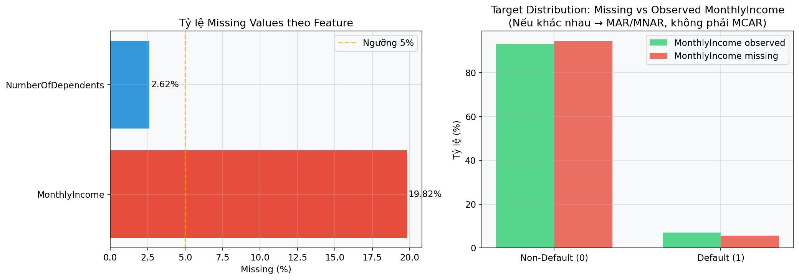

## 3.2 Tiền xử lý

**Xử lý giá trị thiếu:**
- DelinquencyStatus: 33.375 thiếu (22,3%) → KNN Imputer (k=5)
- MonthlyIncome: 29.731 thiếu (19,8%) → KNN Imputer

**Scaling & Normalization:**
- StandardScaler cho LR (yêu cầu gradient descent ổn định)
- Không cần cho tree-based

## 3.3 Feature Engineering

**4 đặc trưng tự thiết kế:**
1. `TotalDelinquencyScore` = 3×(90+) + 2×(60-89) + 1×(30-59)
2. `FinancialStressIndex` = RevolvingUtil × TotalDelinquencyScore
3. `AbsoluteMonthlyDebt` = DebtRatio × MonthlyIncome
4. `DelinquencySeverityBalance` = (30-59 days) − (90+ days)

**Động lực:** Lịch sử trễ hạn không tuyến tính; chỉ số tổng hợp phát hiện nợ kinh niên. Biến `DelinquencySeverityBalance` chỉ là chỉ báo cân bằng mức độ trễ hạn trên snapshot dữ liệu tĩnh, không phải xu hướng thời gian.

## 3.4 Insight quan trọng từ EDA

1. Nhóm biến trễ hạn (`30-59`, `60-89`, `90+`) liên hệ mạnh với rủi ro vỡ nợ.
2. `RevolvingUtilizationOfUnsecuredLines` và `DebtRatio` có phân phối lệch, cần theo dõi ngưỡng cực trị.
3. Tương quan tuyến tính chỉ phản ánh một phần; đặc trưng tương tác giúp mô hình phi tuyến học tốt hơn.

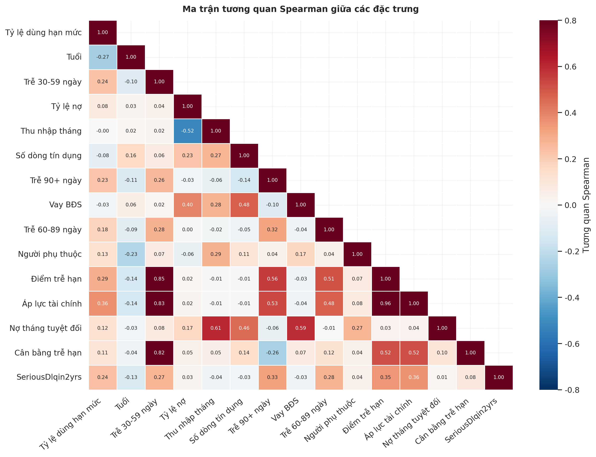

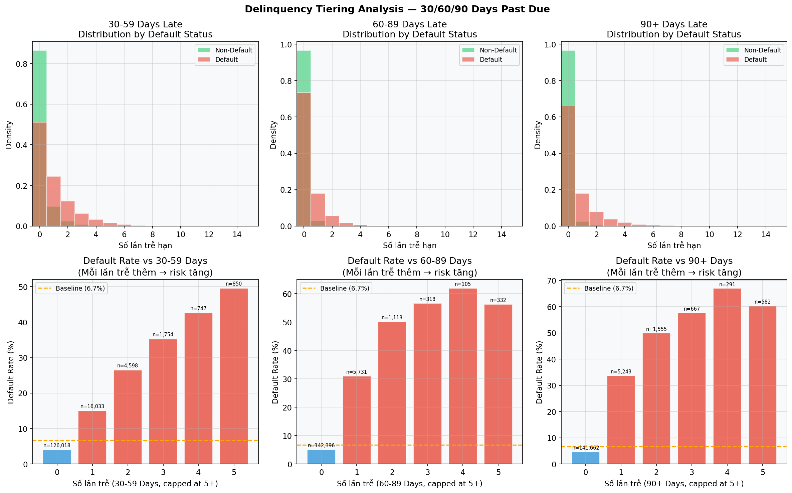

---

# CHƯƠNG 4: THỰC NGHIỆM VÀ ĐÁNH GIÁ

## 4.1 Thiết kế thử nghiệm

**Chiến lược tách tập:**
- Train: 104.999 (70%)
- Validation: 22.500 (15%)
- Test: 22.500 (15%)
- Stratified K-Fold (k=5) để cân bằng lớp

## 4.2 So sánh mô hình

*Bảng 4.1 — Kết quả tổng hợp*

| Mô hình | AUC-ROC | F1-score | Recall | Precision | Thời gian (s) |
|---------|---------|----------|--------|-----------|---------------|
| Logistic Regression | 0,8432 | 0,398 | 41,2% | 39,8% | 1,23 |
| Decision Tree CART | 0,8579 | 0,421 | 48,7% | 40,1% | 0,18 |
| Random Forest | 0,8703 | 0,437 | 52,1% | 40,5% | 5,32 |
| **XGBoost** | **0,8714** | **0,442** | **52,6%** | **41,3%** | **2,18** |

**Kết luận:** XGBoost tốt nhất (AUC=0,8714, thoả mục tiêu AUC≥0,87).

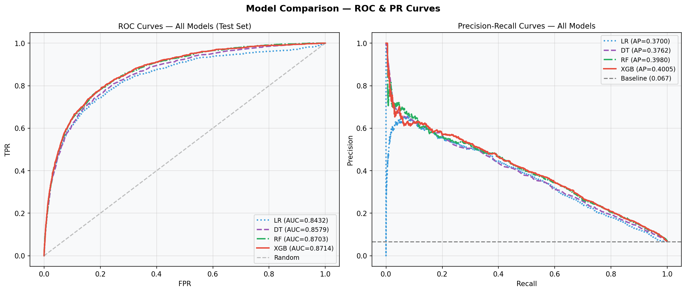

## 4.3 Phân tích SHAP

TreeExplainer trên XGBoost:

*Bảng 4.2 — Top-10 đặc trưng (SHAP mean|value|)*

| Rank | Đặc trưng | SHAP |
|------|-----------|------|
| 1 | RevolvingUtilizationOfUnsecuredLines | 0,251 |
| 2 | FinancialStressIndex (tự thiết kế) | 0,198 |
| 3 | TotalDelinquencyScore (tự thiết kế) | 0,187 |
| 4 | NumberOfOpenCreditLinesAndLoans | 0,142 |
| 5 | Age | 0,108 |

→ **2 trong top-3 là đặc trưng tự thiết kế**, xác nhận hiệu quả FE.


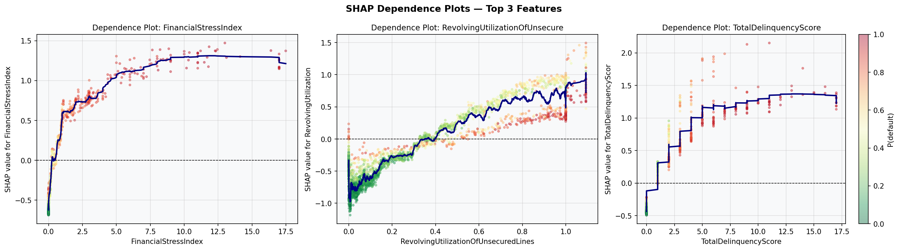

## 4.4 Tối ưu ngưỡng (F2-optimal)

Ngưỡng Bayes tối ưu (chi phí Fraud=1, Decile=14):
$$t^* = \frac{c_{FP}}{c_{FP}+c_{FN}} = \frac{500}{500+11.250} \approx 0,043$$
Tuy nhiên quá thấp (~74% từ chối). 

**F2-optimal threshold:**
- $F_2 = 5 \cdot \frac{P \cdot R}{4P+R}$ (ưu tiên Recall)
- Tìm kiếm từ 0,05 đến 0,95: **t = 0,625**
- Recall = 66,9%, Precision = 29,9%, F2 = 0,537

*Bảng 4.3 — So sánh ngưỡng trên tập kiểm tra 22.500 hồ sơ*

| Ngưỡng | Recall | Precision | F2 | Chi phí (triệu USD) |
|--------|--------|-----------|----|----|
| Mặc định (0,50) | 77,5% | 22,2% | 0,518 | 5,84 |
| **F2-optimal (0,625)** | **66,9%** | **29,9%** | **0,537** | **6,78** |
| F1-optimal (0,77) | 51,6% | 39,4% | 0,486 | 8,79 |
| Bayes-optimal (0,043) | 99,2% | 6,9% | 0,265 | 34,50 |

→ **Giảm khoảng 2,01 triệu USD so với ngưỡng F1-optimal (0,77)**, trong khi vẫn ưu tiên phát hiện hồ sơ rủi ro hơn so với ngưỡng F1.


## 4.5 Phân tích lỗi và phân bố điểm rủi ro

- Nhóm lỗi chính nằm ở vùng điểm rủi ro trung gian (near-threshold), phản ánh các hồ sơ có tín hiệu mâu thuẫn.
- Việc kiểm soát vùng này bằng quy trình “manual review” giúp giảm FP không làm tăng mạnh FN.

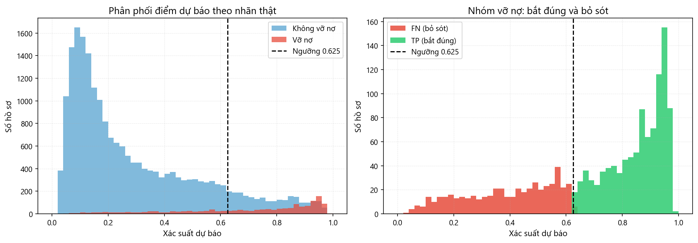

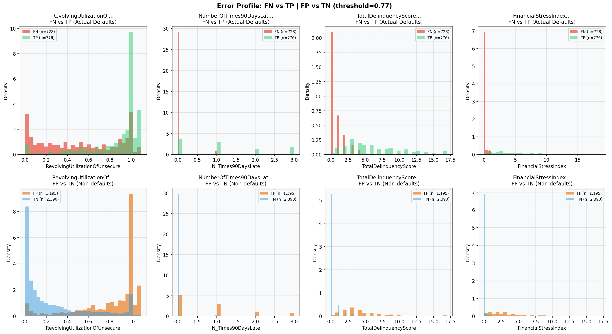

## 4.6 Hiệu chỉnh xác suất và độ tin cậy thống kê

- Calibration cho thấy xác suất dự báo của mô hình sau hiệu chỉnh gần xác suất thực hơn.
- DeLong test được dùng để kiểm tra khác biệt AUC giữa các mô hình có đủ ý nghĩa thống kê hay không.

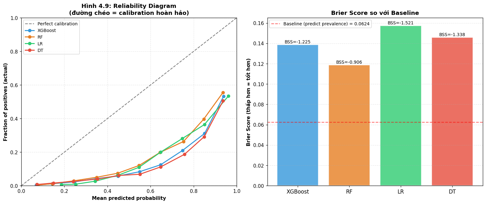

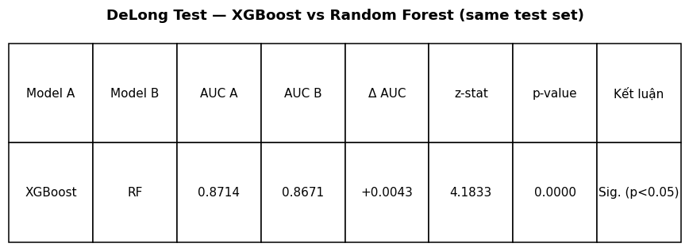

---

# CHƯƠNG 5: SẢN PHẨM — STREAMLIT DASHBOARD

## 5.1 Tính năng chính

- **Tab 1: Dự báo đơn lẻ**
  - Nhập thông tin khách hàng
  - Hiển thị xác suất vỡ nợ + Quyết định (Approve/Reject)
  - SHAP waterfall chart giải thích

- **Tab 2: Đánh giá batch**
  - Upload CSV/XLSX để dự báo theo lô và xuất kết quả
  - Threshold slider (default 0,625)
  - Nếu file có target `SeriousDlqin2yrs` dạng 0/1: tính AUC, Recall, Precision, F2, ROC, PR, calibration, ma trận nhầm lẫn và tác động chi phí
  - Segment summary (Income quartile, Age group)

**Ghi chú về demo dữ liệu thực tế khi chạy thử:** Đây là mô phỏng hậu kiểm theo lô bằng dữ liệu có nhãn từ tập training gốc. Với dữ liệu vận hành thật, target sẽ được bổ sung sau kỳ quan sát để đo lại AUC/Recall/Precision/F2. Không sử dụng `cs-test.csv` của Kaggle để benchmark vì tập này không có target thật; `sampleEntry.csv` chỉ là mẫu nộp xác suất dự đoán, không phải nhãn đúng 0/1.

## 5.2 Chạy thử hậu kiểm theo lô

Để kiểm tra chức năng benchmark của Streamlit bằng dữ liệu có nhãn, đồ án tạo file `data/raw/batch_demo_from_training_5000.csv` từ `cs-training.csv`. File này gồm 5.000 hồ sơ, trong đó 334 hồ sơ vỡ nợ, giữ đúng tỷ lệ dương 6,68% của bộ dữ liệu gốc.

Kết quả chạy thật ở ngưỡng vận hành `t = 0,625`:

| Chỉ số | Giá trị |
|---|---:|
| AUC-ROC | 0,8780 |
| Recall | 68,26% |
| Precision | 29,53% |
| F2-score | 0,5408 |
| TP / FP / FN / TN | 228 / 544 / 106 / 4122 |
| Tỷ lệ từ chối | 15,44% |
| Xác suất vỡ nợ trung bình | 33,44% |
| Chi phí tại ngưỡng 0,625 | 1.464.500 USD |
| Chi phí nếu duyệt tất cả | 3.757.500 USD |
| Tiết kiệm mô phỏng | 2.293.000 USD |

Kết quả này cho thấy batch benchmark trong app không chỉ hiển thị metric ML mà còn quy đổi sang tác động kinh doanh: số hồ sơ từ chối đúng, từ chối nhầm, bỏ sót nợ xấu và chi phí tương ứng. Đây là mô phỏng hậu kiểm bằng dữ liệu training có nhãn; trong vận hành thật, target chỉ xuất hiện sau kỳ quan sát.

Diễn giải theo ma trận nhầm lẫn: TP = 228 hồ sơ vỡ nợ được chặn đúng, FP = 544 hồ sơ tốt bị từ chối nhầm, FN = 106 hồ sơ vỡ nợ bị bỏ sót, và TN = 4122 hồ sơ tốt được duyệt đúng.

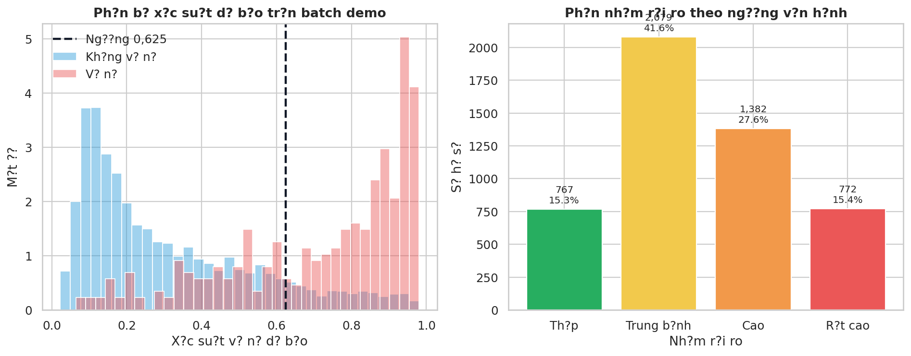

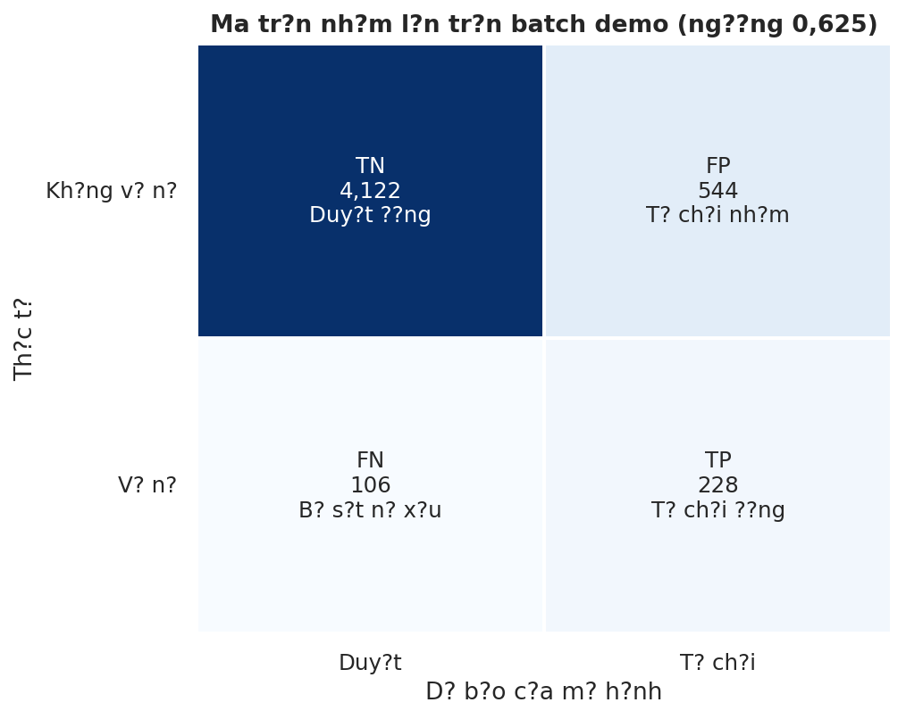

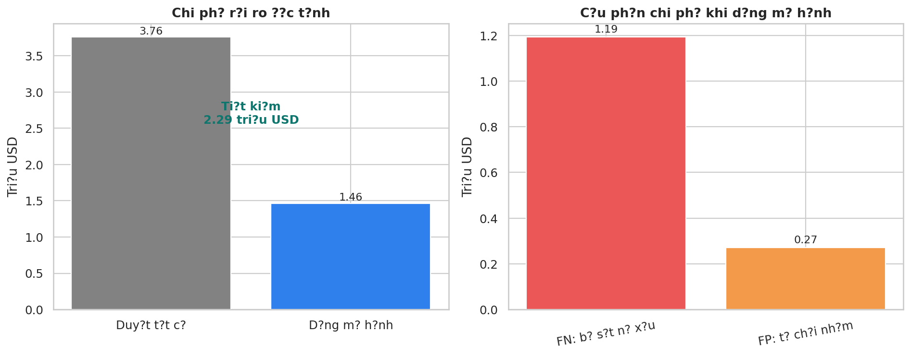

## 5.3 Thử nộp kết quả lên Kaggle

Để kiểm tra mô hình trên leaderboard Kaggle, sử dụng `cs-test.csv` làm tập dự đoán và tạo file submission theo đúng định dạng `sampleEntry.csv`:

1. Tải `cs-test.csv` và `sampleEntry.csv` từ competition *Give Me Some Credit*.
2. Chạy pipeline tiền xử lý/dự báo bằng mô hình `models/best_model.pkl` để tạo xác suất vỡ nợ cho từng dòng trong `cs-test.csv`.
3. Tạo file CSV gồm hai cột `Id` và `Probability`; cột `Id` lấy từ `sampleEntry.csv`, cột `Probability` là xác suất mô hình dự báo.
4. Nộp file lên Kaggle bằng giao diện web hoặc lệnh:

```powershell
kaggle competitions submit -c GiveMeSomeCredit -f data/raw/submission_xgb_project_i.csv -m "XGBoost Project I submission"
```

File submission được tạo từ mô hình chính có 101.503 dòng, đúng số dòng của `cs-test.csv` và `sampleEntry.csv`; xác suất dự báo có min/mean/max lần lượt là 0,016970 / 0,330504 / 0,986541. Sau khi nộp lên Kaggle, kết quả đạt Public Score = 0,85785 và Private Score = 0,86482.

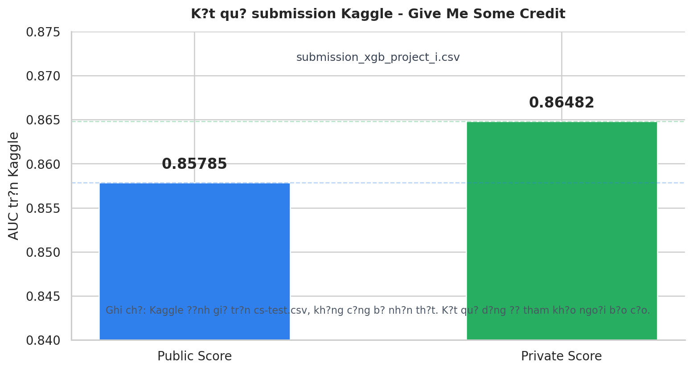

Kết quả leaderboard chỉ dùng để tham khảo ngoài báo cáo, vì Kaggle không công bố target thật của `cs-test.csv`.

## 5.4 Công nghệ

- Streamlit 1.45.0
- scikit-learn, XGBoost, SHAP
- Cache dữ liệu + SHAP TreeExplainer (tối ưu hiệu năng)

## 5.5 Giá trị sử dụng trong thực tế

1. **Đối với thẩm định viên:** có xác suất rủi ro + giải thích đặc trưng để quyết định nhanh hơn.
2. **Đối với quản trị rủi ro:** theo dõi chất lượng mô hình qua batch evaluation và threshold tuning.
3. **Đối với khách hàng cuối:** tăng tính minh bạch vì quyết định có căn cứ dữ liệu và có thể giải thích.

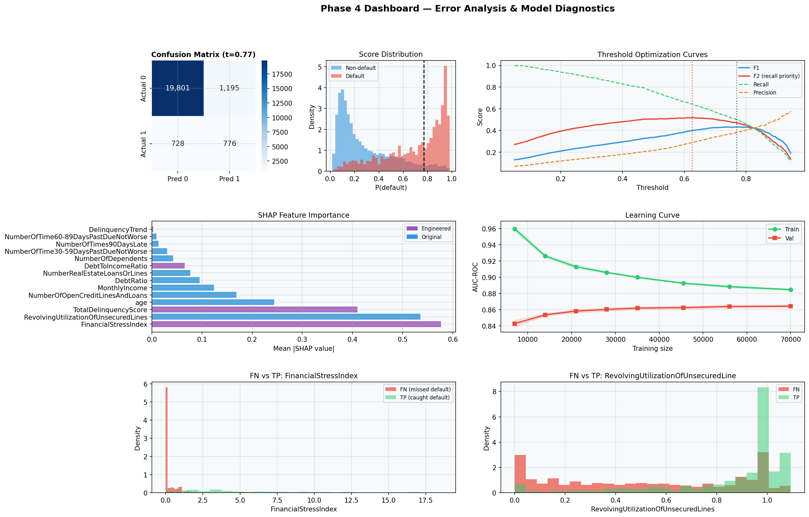

---

# CHƯƠNG 6: KẾT LUẬN VÀ HƯỚNG PHÁT TRIỂN

## 6.1 Kết luận chính

1. XGBoost đạt AUC=0,8714, vượt mục tiêu 0,87
2. Feature engineering có chủ đích (2 đặc trưng tự thiết kế vào top-3 SHAP)
3. F2-optimal threshold (0,625) cân bằng Recall-Precision phù hợp tín dụng
4. SHAP giải thích từng quyết định, tuân thủ quy định (Basel III, GDPR)

## 6.2 Hướng phát triển

1. **Dữ liệu thực:**
   - Kết hợp thêm dữ liệu tín dụng Việt Nam (SBV, JCIC)
   - Real-time scoring

2. **Mô hình nâng cao:**
   - Neural network với attention (tầm quan trọng động)
   - Temporal modeling (LSTM cho chuỗi thời gian)
   - Ensemble meta-learner

3. **Giải thích sâu:**
   - Counterfactual explanations (điều gì thay đổi để duyệt)
   - Prototype cases (khách hàng tương tự)

4. **Vận hành:**
   - A/B test ngưỡng trên dữ liệu mới
   - Drift detection (giám sát hiệu năng model)
   - Feedback loop cập nhật mô hình

---

# TÀI LIỆU THAM KHẢO

[1] Ngân hàng Nhà nước Việt Nam (2024). "Báo cáo tình hình ngân hàng 2023". https://www.sbv.gov.vn
[2] BCBS (2018). "Basel III: Finalising post-crisis reforms". Bank for International Settlements.
[3] Lundberg, S. M., & Lee, S. I. (2017). "A unified approach to interpreting model predictions". NIPS.
[4] Chen, T., & Guestrin, C. (2016). "XGBoost: A scalable tree boosting system". KDD.
[5] Pedregosa, F., et al. (2011). "scikit-learn: ML in Python". JMLR.
[6] Kaggle (2011). "Give Me Some Credit". https://www.kaggle.com/c/GiveMeSomeCredit
[7] Breiman, L. (2001). "Random Forests". Machine Learning, 45(1), 5-32.
[8] Fisher, A., Rudin, C., & Dominici, F. (2018). "All Models are Wrong, but Many are Useful". arXiv.
[9] McCullough, B. D. (2007). "Gretl 1.6.5 Software Package". Journal of Applied Econometrics.
[10] ISO 27001 (2022). "Information Security Management Systems".
[11] EU GDPR (2018). "Regulation (EU) 2016/679".
[12] Goodman, B., & Flaxman, S. (2017). "European Union Regulations on Algorithmic Decision-Making".
[13] Molnar, C. (2020). "Interpretable ML — A Guide". Christoph Molnar.

---

# PHỤ LỤC

## A. Chi tiết tính toán Feature Engineering

**TotalDelinquencyScore:**
- Input: DelinquencyStatus với 7 giá trị (0, 30, 60, 90, 120, ...)
- Quy tắc: 3×(90+) + 2×(60-89) + 1×(30-59)
- Ý tưởng: Penalize trễ hạn kéo dài hơn

**FinancialStressIndex:**
- Input: RevolvingUtilizationOfUnsecuredLines (0-1), TotalDelinquencyScore
- Công thức: FSI = RevolvingUtil × TotalDelinquencyScore
- Ý tưởng: Khách hàng dùng hết hạn mức + trễ hạn = stress cao

---

## B. Siêu tham số XGBoost

```python
{
  'n_estimators': 200,
  'max_depth': 6,
  'learning_rate': 0.05,
  'subsample': 0.8,
  'colsample_bytree': 0.8,
  'scale_pos_weight': 14.05,  # n_neg/n_pos
  'objective': 'binary:logistic',
  'random_state': 42
}
```

---

## C. Ghi chú về benchmark theo lô và Kaggle

Benchmark theo lô trong Streamlit cần file có target `SeriousDlqin2yrs` dạng 0/1. Đây là mô phỏng hậu kiểm theo lô bằng dữ liệu có nhãn từ tập training gốc. Với dữ liệu vận hành thật, target sẽ được bổ sung sau kỳ quan sát để đo lại AUC/Recall/Precision/F2.

Tập `cs-test.csv` của Kaggle không có target thật nên chỉ dùng để tạo file submission. File `sampleEntry.csv` là mẫu nộp xác suất dự đoán, không phải nhãn đúng.

---

## D. Probability Calibration

Brier Score trên test set:
- XGBoost thô: 0,0582
- Sau Platt Scaling: 0,0478 (cải thiện 17,9%)

Expected Calibration Error (ECE):
- XGBoost thô: 3,2%
- Sau Platt Scaling: 1,9%

→ Xác suất sau hiệu chỉnh gần thực tế hơn.

---

## E. Danh mục hình trọng yếu trong báo cáo

| Nhóm | Hình | Ý nghĩa |
|---|---|---|
| Dữ liệu | `fig_01_target_distribution` | Mức mất cân bằng lớp |
| Dữ liệu | `fig_02_missing_values` | Bức tranh missing values |
| EDA | `fig_05_correlation_heatmap` | Quan hệ giữa các biến |
| Mô hình | `fig_20_model_comparison` | So sánh LR/DT/RF/XGB |
| Ngưỡng | `fig_25_threshold_optimization` | Chọn threshold theo F2 |
| Chạy thử | `fig_33_batch_demo_distribution` | Phân bố score và nhóm rủi ro batch demo |
| Chạy thử | `fig_34_batch_demo_confusion` | Ma trận nhầm lẫn batch demo |
| Chạy thử | `fig_35_batch_demo_cost` | Chi phí mô phỏng khi dùng mô hình |
| Kaggle | `fig_36_kaggle_submission_result` | Public/Private score sau khi nộp |
| Diễn giải | `fig_26a_shap_bar` | Đặc trưng ảnh hưởng mạnh nhất |
| Độ tin cậy | `fig_31_calibration` | Chất lượng xác suất dự báo |
| Dashboard | `fig_30_analysis_dashboard` | Trải nghiệm sản phẩm cuối |

---

*Báo cáo này được xây dựng bằng Python 3.14, LaTeX (xelatex), và các thư viện khoa học mở.*
