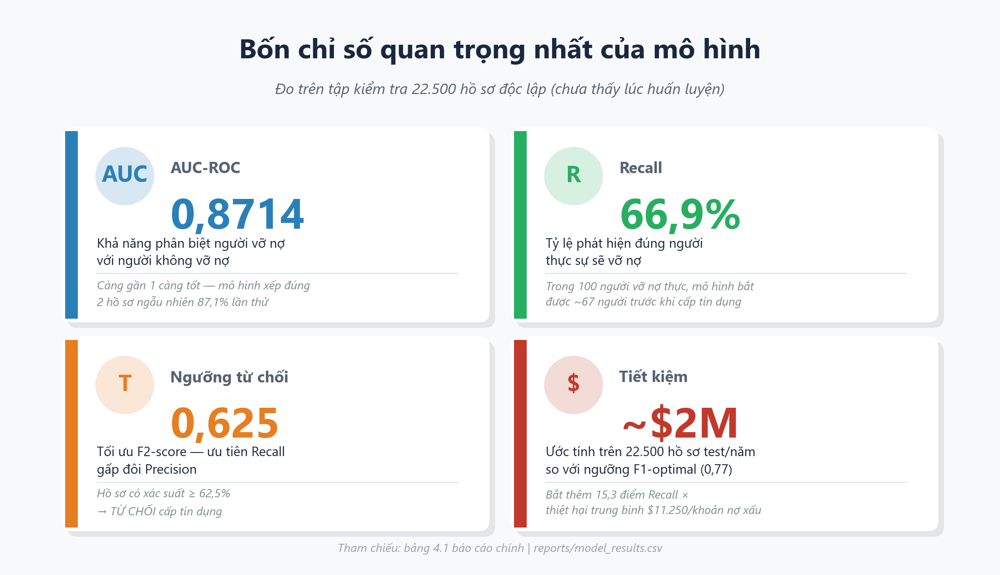
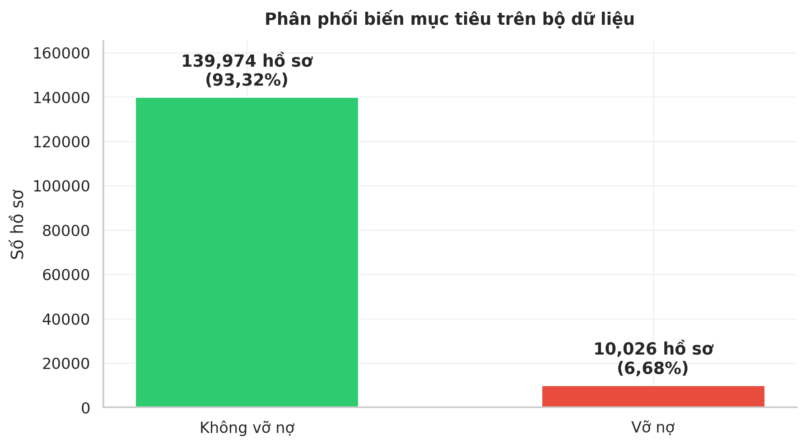
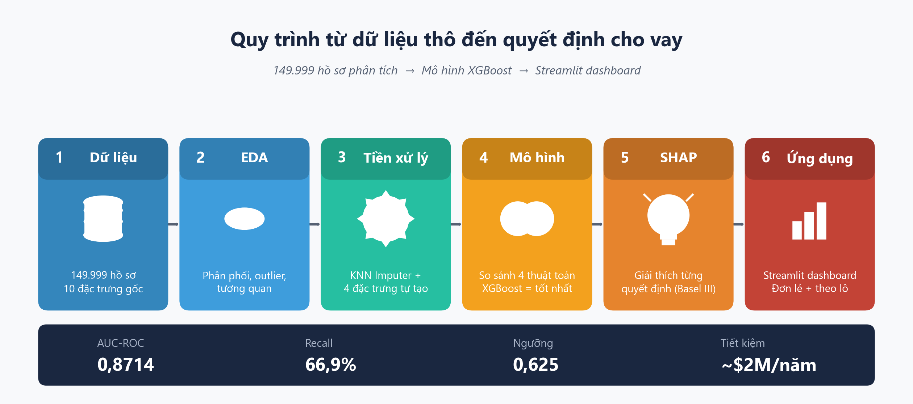
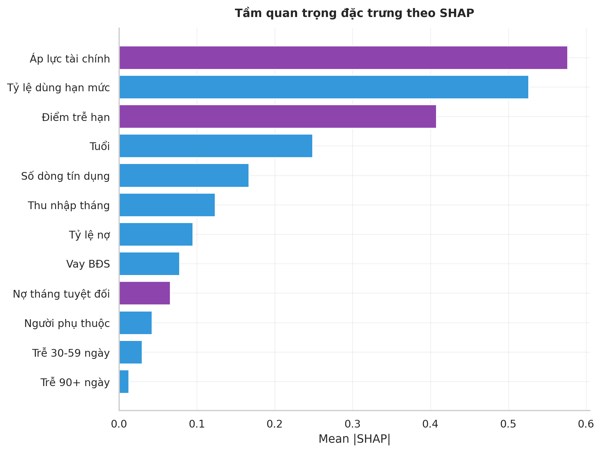
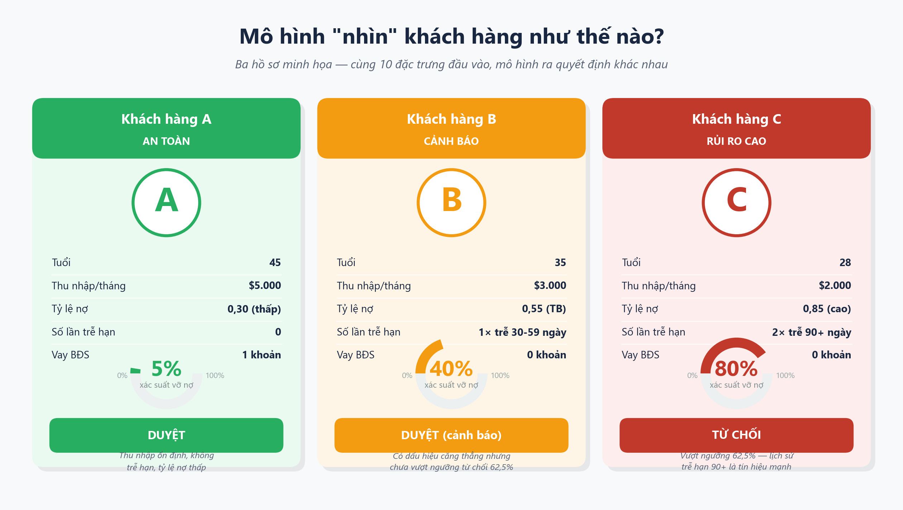
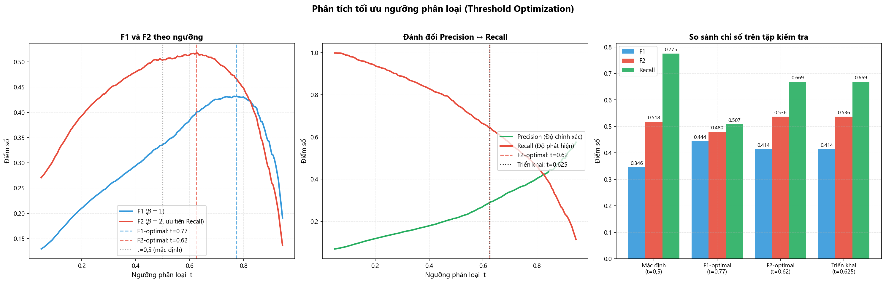

# Tóm tắt trực quan: Dự báo Rủi ro Vỡ nợ Tín dụng

**Đoàn Danh Long — MSSV 20237354 | GVHD: Nguyễn Cảnh Nam | Đồ án I, 2025–2026**

---

## Kết quả nổi bật

| Chỉ số | Giá trị |
|---|---|
| **AUC-ROC tốt nhất** | **0,8714** (XGBoost) |
| **Recall ở ngưỡng triển khai 0,625** | **66,9%** — tăng từ 51,6% ở ngưỡng F1-optimal (0,77) |
| **Ngưỡng từ chối** | **0,625** — tối ưu F2-score (ưu tiên Recall gấp đôi Precision) |
| **Tiết kiệm ước tính** | **~$2 triệu USD/năm** trên 22.500 hồ sơ test, so với ngưỡng F1-optimal |
| **Top features** | FinancialStressIndex, TotalDelinquencyScore — **2/3 đặc trưng quan trọng nhất là tự tạo** |

---

## Bài toán là gì?

Dự báo khách hàng có vỡ nợ trong **2 năm tới** hay không, dựa trên thông tin tài chính lịch sử.

- **Dữ liệu:** 149.999 hồ sơ vay tiêu dùng Mỹ (Kaggle — Give Me Some Credit)
- **Mất cân bằng:** Chỉ **6.68%** hồ sơ thực sự vỡ nợ → mô hình không thể chỉ dùng Accuracy

---

## Pipeline hoạt động ra sao?

1. **Dữ liệu thô** — 10 đặc trưng tài chính (tỷ lệ nợ, lịch sử trễ hạn, thu nhập, tuổi, ...)
2. **EDA** — phát hiện outlier, phân phối lệch, tương quan
3. **Tiền xử lý** — KNN Imputer cho giá trị thiếu, tạo thêm 4 đặc trưng kỹ thuật
4. **Mô hình** — so sánh 4 thuật toán: LR, Decision Tree, Random Forest, **XGBoost**
5. **Giải thích** — SHAP TreeExplainer: feature nào quan trọng, vì sao mô hình quyết định như vậy
6. **Ứng dụng** — Streamlit dashboard: dự báo + giải thích từng hồ sơ

---

## Điều gì quan trọng nhất khi mô hình ra quyết định?

- **FinancialStressIndex** = Tỷ lệ sử dụng hạn mức × Điểm trễ hạn tổng hợp → đặc trưng **tự tạo**
- **TotalDelinquencyScore** = 3×(trễ 90+) + 2×(trễ 60-89) + 1×(trễ 30-59) → **tự tạo**
- **RevolvingUtilizationOfUnsecuredLines** — tỷ lệ sử dụng hạn mức tín dụng → từ dataset gốc

→ **2 trong 3 yếu tố quan trọng nhất là features tự thiết kế**, không có sẵn trong dataset.

---

## Mô hình "nhìn" khách hàng như thế nào?

| Hồ sơ | Đặc điểm | Xác suất vỡ nợ | Quyết định |
|---|---|---|---|
| **Khách hàng A (An toàn)** | Tuổi 45, thu nhập $5.000, không trễ hạn bao giờ, tỷ lệ nợ 0,30 | ~5% | ✅ DUYỆT |
| **Khách hàng B (Cảnh báo)** | Tuổi 35, thu nhập $3.000, trễ 1 lần 30-59 ngày, tỷ lệ nợ 0,55 | ~40% | ⚠️ DUYỆT (cảnh báo) |
| **Khách hàng C (Rủi ro cao)** | Tuổi 28, thu nhập $2.000, trễ 2 lần >90 ngày, tỷ lệ nợ 0,85 | ~80% | ❌ TỪ CHỐI |

---

## Tại sao chọn ngưỡng 0.625 thay vì 0.5?

Trong tín dụng: **bỏ sót 1 người sẽ vỡ nợ** (FN — False Negative) tốn kém hơn nhiều so với **từ chối nhầm 1 người tốt** (FP — False Positive).

- Ngưỡng F1-optimal (0,77): Recall = 51,6%, F1 = 0,447 (tối đa F1 nhưng bỏ sót 48,4% người vỡ nợ)
- Ngưỡng F2-optimal **(0,625): Recall = 66,9%, F2 = 0,537 — tiết kiệm thêm ~$2 triệu so với 0,77**

F2-score ưu tiên Recall gấp đôi Precision — phù hợp với logic kinh doanh tín dụng.

> **Diễn giải nhanh:** Nếu thẩm định 22.500 hồ sơ với chi phí trung bình $11.250/khoản nợ xấu (FN) và $500/khoản từ chối nhầm (FP), ngưỡng 0,625 cho tổng chi phí thấp hơn ~$2 triệu so với ngưỡng F1-optimal 0,77.

---

## Liên kết tài liệu

| Tài liệu | Mô tả |
|---|---|
| [`final_report/bao_cao_chinh.md`](bao_cao_chinh.md) | Báo cáo đầy đủ 7 chương (~800 dòng) |
| [`presentation/slide.md`](../presentation/slide.md) | 29 slides defense kỹ thuật (Marp) |
| [`presentation/slide_executive_summary.md`](../presentation/slide_executive_summary.md) | 7 slides tóm tắt cho người không chuyên |
| [`presentation/defense_guide.md`](../presentation/defense_guide.md) | Q&A + toán học chi tiết để chuẩn bị bảo vệ |
| [`app/app.py`](../app/app.py) — `streamlit run app/app.py` | Dashboard tương tác |
